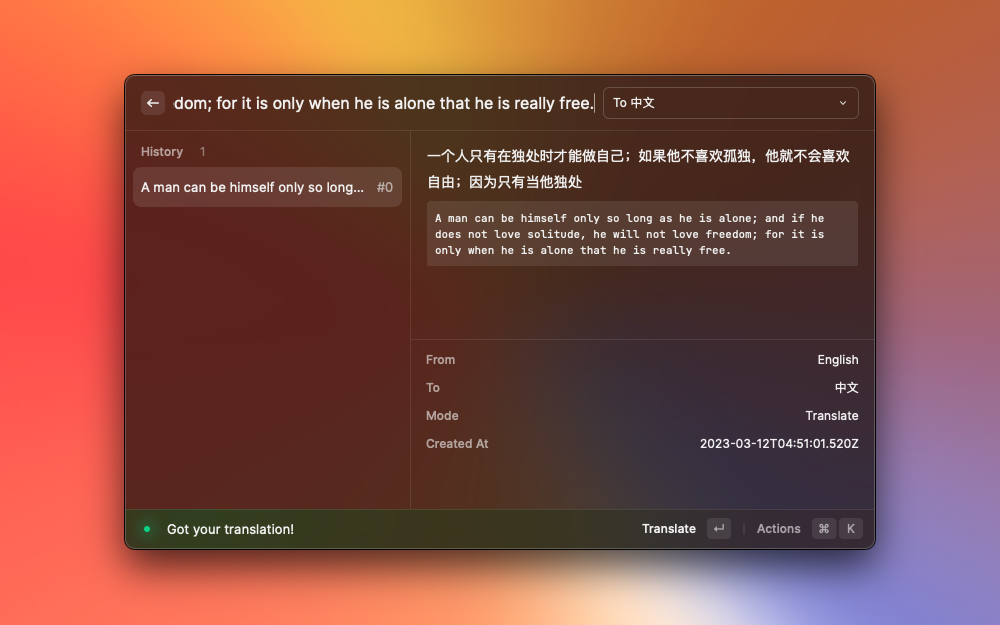

# OpenAI Translator

基于 ChatGPT API 的 [Raycast](https://www.raycast.com/) 翻译扩展。

https://user-images.githubusercontent.com/743074/224527077-8256a26a-bbeb-482e-86fa-74fe435e59fe.mov

# Insipired By

- [yetone/openai-translator](https://github.com/yetone/openai-translator)
- [yihong0618/iWhat](https://github.com/yihong0618/iWhat)

# 参考(Cpoy)

- [yetone/openai-translator](https://github.com/yetone/openai-translator) (MIT License)
- [abielzulio/chatgpt-raycast](https://github.com/abielzulio/chatgpt-raycast) (MIT License)

# 安装

## 手动

``` shell
git clone https://github.com/douo/raycast-openai-translator.git
cd raycast-openai-translator
npm install && npm run dev
```

扩展成功显示后就可以 `Ctrl-c` 结束 npm 进程，扩展能继续使用。

## 商店

等待 Raycast 审核: https://github.com/raycast/extensions/pull/5306

# 功能


获取你的 [OpenAI](https://platform.openai.com/account/api-keys) API Key.

## 主要功能

- 划词翻译
- 截图翻译
- 剪切板文本翻译
- 可绑定全局快捷键


## 翻译模式


感谢 [yetone/openai-translator](https://github.com/yetone/openai-translator)：

- 翻译
- 润色
- 总结




- What/What is it?(文本识别) (感谢 [yihong0618/iWhat](https://github.com/yihong0618/iWhat) 的 Prompts)


## 其他

- [x] 历史记录
- [x] 文本复制
- [x] 流式文本显示
- [x] 手动指定文本语言（自动检测在混合有多语言字符的情况下还不太靠谱）
- [x] 自定义 API URL
- [ ] Proxy
- [ ] i18n
- [ ] TTS


# 如何配置划词搜索

- 进入扩展配置（`⌘+⇧+,`）
  1. 选择 "Query Seleceted"
  2. 如下图所示配置快捷键
  3. 确保 "Query Mode" 为 "Translate"


全键盘操作的效果：

https://user-images.githubusercontent.com/743074/224528436-afca923d-b781-4754-86f5-e6b439b3e9e9.mov


# OCR

https://user-images.githubusercontent.com/743074/225798866-d3ef4e6a-53e7-4281-a026-16a5c574f074.mov
