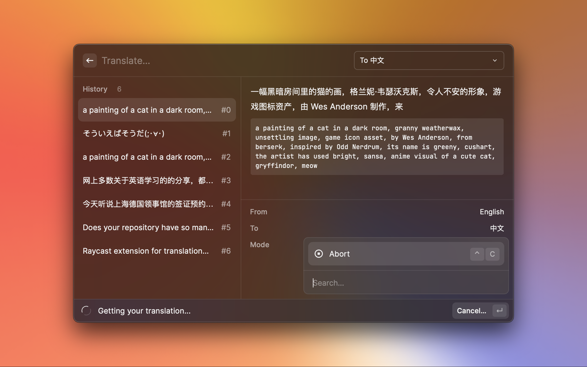

# OpenAI Translator

[Raycast](https://www.raycast.com/) extension for translation based on ChatGPT API.

https://user-images.githubusercontent.com/743074/224527077-8256a26a-bbeb-482e-86fa-74fe435e59fe.mov

# Insipired By

- [yetone/openai-translator](https://github.com/yetone/openai-translator)
- [yihong0618/iWhat](https://github.com/yihong0618/iWhat)

# Learn(Cpoy) a lot from

- [yetone/openai-translator](https://github.com/yetone/openai-translator) (MIT License)
- [abielzulio/chatgpt-raycast](https://github.com/abielzulio/chatgpt-raycast) (MIT License)

# Install

## Manual

``` shell
git clone https://github.com/douo/raycast-openai-translator.git
cd raycast-openai-translator
npm install && npm run dev
```

After the extension command show up, You can stop(`Ctrl-c`) the server safely.

## Store

Waitting  Raycast's review : https://github.com/raycast/extensions/pull/5306

# Feature


Thanks to [yetone/openai-translator](https://github.com/yetone/openai-translator)：

- Translate
- Polishing
- Summarize


- What/What is it? (Thanks to [yihong0618/iWhat](https://github.com/yihong0618/iWhat) 的 Prompts)


From Raycast:

- Automatically import the currently selected text
- Automatically import clipboard text
- Bindable global shortcuts


Others:

- History records
- Text copy
- Stream text display
- Manually specify text language (automatic detection is not reliable when mixing multiple languages)
- Custom API Entrypoint
- [ ] Proxy
- [ ] i18n
- [ ] TTS




# How to configure one-click query

- Configure the extension
  1. Configure global shortcuts
  2. Ensure that automatic import of highlighted text and automatic start of query are enabled


The example of pure keyboard operation:

https://user-images.githubusercontent.com/743074/224528436-afca923d-b781-4754-86f5-e6b439b3e9e9.mov
