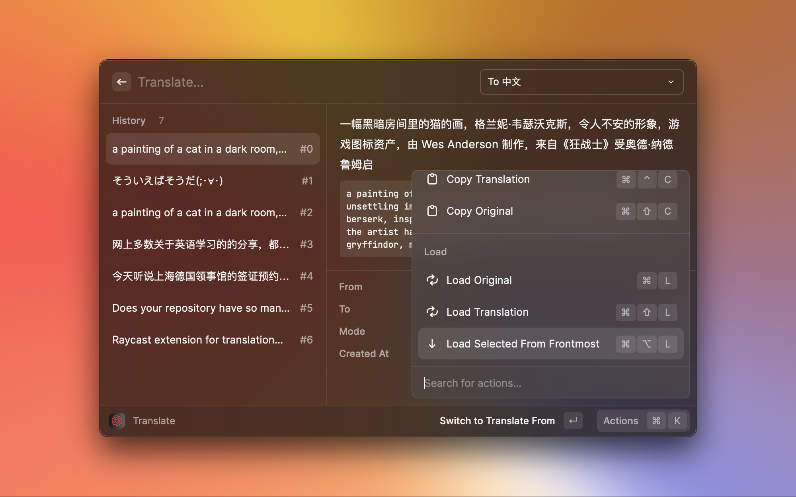
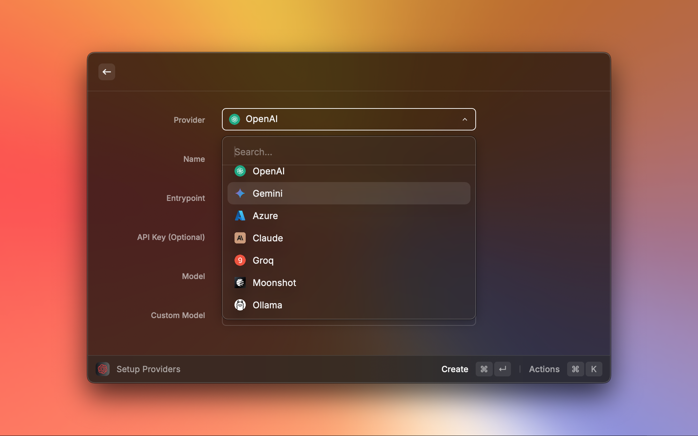

# OpenAI Translator

[Raycast](https://www.raycast.com/) extension for translation based on ChatGPT API.

Quick Tips and Tricks:
[](https://www.youtube.com/watch?v=2tW9iKz2nT0)


# Insipired By

- [yetone/openai-translator](https://github.com/yetone/openai-translator)
- [abielzulio/chatgpt-raycast](https://github.com/abielzulio/chatgpt-raycast)
- [yihong0618/iWhat](https://github.com/yihong0618/iWhat)

# Install

## Store

[Raycast OpenAI Translator](https://www.raycast.com/douo/openai-translator)

## Manual

``` shell
git clone https://github.com/douo/raycast-openai-translator.git
cd raycast-openai-translator
npm install && npm run dev
```

After the extension command show up, You can stop(`Ctrl-c`) the server safely.


# Feature


It is recommended to set the Provider to "Custom..." and then manage your Providers using the "Setup Provider" command.


## Main Feature

- Selected text translation
- Screencapture translation（Powered by macOS Vision API）
- Clipboard text translation
- Global shortcut(Go to the Raycast extension configuration page to configure it manually)




## Translation Mode


- Translate
- Polishing
- Summarize
- What/What is it?


## Multiple LLM Provider Support



- [OpenAI ChatGPT](https://chat.openai.com/)
- [Raycast AI](https://www.raycast.com/pro)
- [Azure OpenAI Service](https://azure.microsoft.com/en-us/products/cognitive-services/openai-service)
- [Gemini](https://gemini.google.com/)
- [Claude](https://claude.ai/)
- [Groq](https://groq.com/)
- [Moonshot](https://moonshot.cn/)
- [Ollama](https://ollama.com/)

### OpenAI ChatGPT

- API Entrypoint: https://api.openai.com/v1/chat/completions
- API Key: Get your [OpenAI](https://platform.openai.com/account/api-keys) API Key.
- API Model: gpt-3.5-turbo/etc

### Raycast AI

- API Entrypoint: none
- API Key: none
- API Model: No configuration required.

Requires [Raycast Pro](https://www.raycast.com/pro) to support.

### Azure OpenAI Service

- API Entrypoint:`https://${resourceName}.openai.azure.com/openai/deployments/${deployName}/chat/completions?api-version=${apiVersion}`
- API Key: [Azure](https://portal.azure.com/) -> Azure OpenAI -> Keys and Endpoint
- API Model：No configuration required.

### Gemini

- API Key: [Google AI Studio -> Get API Key](https://aistudio.google.com/app/apikey)

### Claude

- API Key: [Anthrop Console](https://console.anthropic.com/settings/keys)

### Groq

- API Key: [GroqCloud](https://console.groq.com/keys)

### Moonshot

- API Key: [Moonshot AI](https://platform.moonshot.cn/console/api-keys)

### Ollama

[OpenAI compatibility](https://ollama.com/blog/openai-compatibility)

## Others

- [x] History records
- [x] Text copy
- [x] Stream text display
- [x] Manually specify text language (automatic detection is not reliable when mixing multiple languages)
- [x] Custom API Entrypoint
- [X] Proxy
- [ ] i18n
- [ ] TTS


# How to configure shortcut to selected text query

- Configure the extension(`⌘+⇧+,`).
  1. Select "Query Selected"
  2. Setup shortcut
  3. Make sure "Query Mode" is "Translate".


