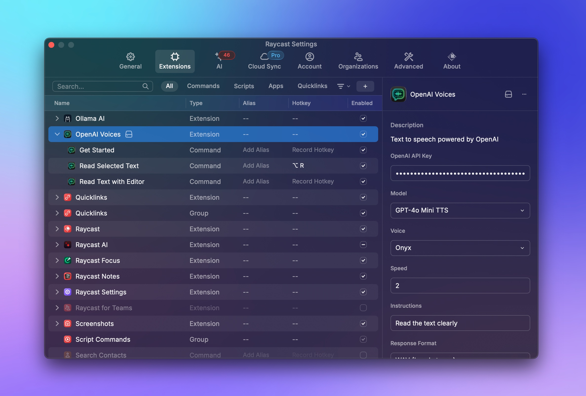

# OpenAI Voices

*Turn any selected text into lifelike speech using [OpenAI's advanced TTS models](https://platform.openai.com/docs/models/gpt-4o-mini-tts) – directly from Raycast.*

---

## Why This Extension Exists

I'm dyslexic (shoutout to fellow dyslexics! 👋), and I just wanted something that could read any text to me. Whether I'm browsing the web, in Slack, poking around Cursor agent chats, or anywhere else on my Mac.

The built-in Mac and Chrome voices are still stuck in the uncanny valley, and Chrome extensions like Speechy require a subscription to be truly useful. So I built this with goal of pay-as-you-go high-quality text-to-speech for *any* selected text, anywhere on your system, powered by OpenAI's latest voices—right from Raycast. Enjoy!

---

## ✨ Features

* **Interactive Text Editor** – Opens a form where you can view, edit, and read selected text or clipboard content.
* **Latest Models & Voices** – Uses `gpt-4o-mini-tts` (default) with advanced speech control, plus `tts-1` and `tts-1-hd` models.
* **All 11 Voices Available** – Choose from `alloy`, `ash`, `ballad`, `coral`, `echo`, `fable`, `nova`, `onyx`, `sage`, and `shimmer`.
* **Advanced Speech Control** – Add custom instructions to control accent, tone, emotion, speed, and speaking style.
* **Multiple Audio Formats** – Support for WAV (default), MP3, AAC, and FLAC output formats.
* **Audio File Management** – Option to save generated audio files to `~/.cache/raycast-openai-voices/` for debugging and reuse.
* **Real-time Feedback** – Visual feedback during speech generation with detailed error handling.

---

## 📦 Installation

Install from the [Raycast Store](https://raycast.com/store) - search for "OpenAI Voices" or install directly from this page.

### Commands Available
- **"Get Started"** – Onboarding and configuration help
- **"Read Selected Text"** – Main text-to-speech interface
- **"Read Text with Editor"** – Opens text editor for writing and reading custom text

---

## 🔑 API Key Required

This extension requires an OpenAI API key to function. You can get one from [OpenAI's API Keys page](https://platform.openai.com/api-keys).

---

## ⚙️ Accessing Settings

To configure the extension:

1. Open **Raycast Settings** (`Cmd + ,`)
2. Navigate to **Extensions** tab
3. Find **OpenAI Voices** in the list
4. Click the extension name to open its settings panel
5. Configure your preferences (API key, voice, model, etc.)

**💡 Pro Tip:** Set up a hotkey like `⌥ + R` (Option + R) for the "Read Selected Text" command to quickly access text-to-speech from any application without opening Raycast first. You can see this configured in the screenshot above.

All changes are saved automatically and take effect immediately.

---

## 📋 Configuration Options

| Preference          | Type / Default              | Description                                                     |
| ------------------- | --------------------------- | --------------------------------------------------------------- |
| `openaiApiKey`      | Password (required)         | Your OpenAI secret key (`sk-…`).                                |
| `model`             | Dropdown – `gpt-4o-mini-tts`| TTS model: `gpt-4o-mini-tts`, `tts-1-hd`, or `tts-1`.          |
| `voice`             | Dropdown – `onyx`           | Voice selection from all 11 available voices.                   |
| `speed`             | Text – `1.5`                | Playback speed **0.25 – 4.0** (1.0 = normal, 1.5 = default).  |
| `instructions`      | Text (optional)             | Custom instructions for speech style, accent, tone, emotion.    |
| `response_format`   | Dropdown – `wav`            | Audio format: WAV, MP3, AAC, or FLAC.                          |
| `saveAudioFiles`    | Checkbox – `false`          | Save generated audio files permanently for debugging/reuse.     |

---

## 🚀 Usage

### Basic Usage
1. **Select text** in any app —or— copy text to the clipboard.
2. Open Raycast and run **"Read Selected Text"**.
3. The extension opens with your text pre-loaded in an editable form.
4. **Edit the text** if needed, then press **Enter** or click **"Read Aloud"**.
5. Audio generation begins with real-time feedback and plays automatically.

### Advanced Features
- **Custom Instructions**: Add instructions like "Speak in a cheerful tone" or "Use a British accent"
- **Audio Formats**: Choose the format that works best for your needs (WAV recommended for best streaming)
- **Save Files**: Enable "Save Audio Files" to keep generated speech in `~/.cache/raycast-openai-voices/`
- **Speed Control**: Adjust playback speed from 0.25x to 4.0x (default 1.5x for faster listening)

---

## 🎙️ Voice & Model Options

### Models
- **`gpt-4o-mini-tts`** (default) – Latest model with advanced speech control and instruction following
- **`tts-1-hd`** – High-definition audio quality
- **`tts-1`** – Standard quality with lower latency

### Voices
All 10 OpenAI voices are available: `alloy`, `ash`, `ballad`, `coral`, `echo`, `fable`, `nova`, `onyx`, `sage`, `shimmer`

### Instructions Examples
- "Speak very clearly and slowly"
- "Use an excited, enthusiastic tone"
- "Read like a news anchor"
- "Speak in a whisper"
- "Use a British accent"

---

## 💾 Audio File Management

The extension handles audio files intelligently:

- **Temporary mode** (default): Files are created temporarily and cleaned up after playback
- **Persistent mode**: Enable "Save Audio Files" to keep files in `~/.cache/raycast-openai-voices/` for reuse
- **Format matching**: File extensions automatically match your selected audio format
- **Native playback**: Uses macOS's built-in `afplay` for maximum compatibility

---

## 🐛 Troubleshooting

### No Audio Output
1. Check system volume and audio output device
2. Enable "Save Audio Files" to test files manually with `afplay`
3. Try different audio formats (WAV recommended for best performance)
4. Check console output for detailed error messages

### Audio Quality Issues
1. Switch to `tts-1-hd` model for higher quality
2. Try different voices to find the best match
3. Adjust speed settings (slower speeds often sound clearer)

### File Issues
1. Check `~/.cache/raycast-openai-voices/` if saving is enabled
2. Verify file extensions match the selected format
3. Test saved files manually: `afplay ~/.cache/raycast-openai-voices/filename.wav`

---

## 📄 License

MIT © 2025 Andy Pai – Not affiliated with OpenAI. Voices are provided by OpenAI; always disclose AI-generated speech to users, per OpenAI policies.