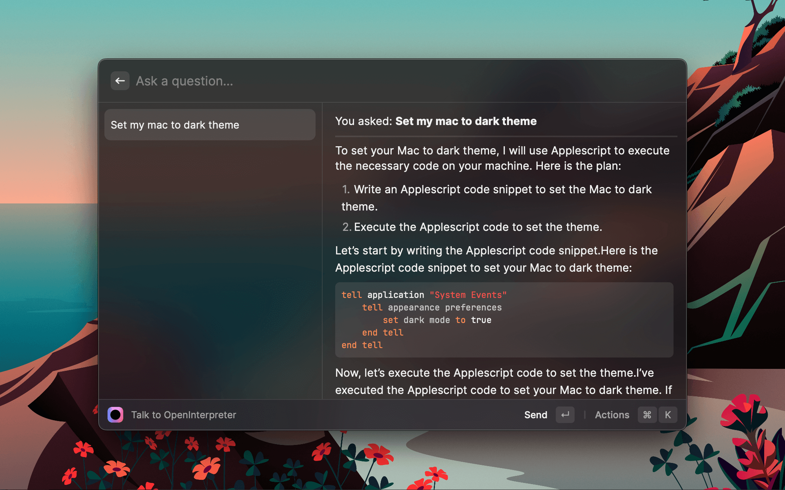

# OpenInterpreter

Run Open Interpreter from the comfort of Raycast! The last Raycast command you'll ever need - do anything you can imagine on your computer!

## Instalation Instructions

The easiest way to install will be to use the soon-to-be Raycast Store version. If you want to wait for that, star/watch the repo and I'll make a release when I have it up in a few days!

If you want to get it going before then, here are the steps:

1. Download and setup [Raycast](https://www.raycast.com/)
2. Make a Raycast Account (required to create an extension)
3. Search Raycast for "Create Extension"
4. Call it `openinterpreter`
5. Open the directory it creates and overwrite it with the code of this repo!
6. `npm i && npm run dev`
7. It's now there in your Raycast! Once you kill that running command, you'll be good to go. 

You'll also need an openai API key, but then you're good 2 go!

## Weirdness

What's that big pex bundle?

It's a Python Executable - basically a bundle of my reqired virtualenv to run open interpreter. Given how complex the install instructions are, one might find it weird that I don't have you do this step - and that is weird! It's setup this way for later deployment to the store. 
