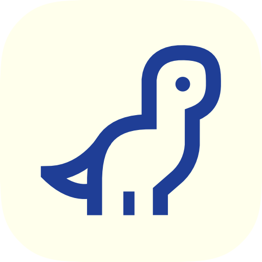

<div align="center">



# Osaurus

[](https://www.raycast.com/chrismessina/osaurus)
[](LICENSE)
[](https://github.com/chrismessina)

**Ask the AI models running privately on your Mac, from Raycast.**

[Features](#features) • [Requirements](#requirements) • [Quick Start](#quick-start) • [Usage](#usage) • [Development](#development)

</div>

---

## Features

- **Ask a local model** — type a question in the search bar and the answer streams in beside it. Ask follow-ups in the same chat, stop a long answer, and show or hide the model's thinking
- **Your models in Raycast AI** — Osaurus appears as a provider in Raycast AI Chat and AI Commands, alongside the cloud models
- **Manage models** — size, quantization, context length, capabilities, and default parameters for every installed model. Pick the default model for Ask Osaurus and hide the ones you don't use
- **Find new models** — search Hugging Face for MLX models, or paste a model link, then hand it to Osaurus to download
- **Search your history** — find any Osaurus chat by title or message text, and export the conversation as Markdown in the same format Osaurus uses
- **Starts Osaurus for you** — when the server isn't running, open Osaurus from the empty view or the toast

---

## Requirements

- [Osaurus](https://osaurus.ai) on an Apple Silicon Mac. It runs the models and serves them at `http://localhost:1337`
- For the Raycast AI provider: Raycast 2.5 or later, with Osaurus turned on in Raycast's AI settings

---

## Quick Start

1. Install and open [Osaurus](https://osaurus.ai), and download a model in it (or use **Search Models** here)
2. Open Raycast and search for **Ask Osaurus**
3. Type a question and press ↵

---

## Usage

### Commands

| Command | Mode | Description |
| --- | --- | --- |
| Ask Osaurus | `view` | Ask a local model a question and follow up in the same chat |
| Manage Models | `view` | Browse your models, set the default for Ask Osaurus, and open or quit Osaurus |
| Search Models | `view` | Search Hugging Face for MLX models, or paste a link, and add one to Osaurus |
| Search History | `view` | Search your Osaurus chats and export a conversation as Markdown |

### Actions

**Ask Osaurus**

| Action | Shortcut | Description |
| --- | --- | --- |
| Get Answer | `↵` | Ask the question in the search bar |
| Stop Answering | `↵` | While a model is answering |
| Ask a Follow-Up | `↵` | On an answered question, with the search bar empty |
| Full Text Input | `⌘ T` | Write a longer prompt in a form |
| Show / Hide Thinking | `⌘ I` | The model's reasoning, for models that think |
| Copy Answer | `⌘ ⇧ C` | |
| New Chat | `⌘ N` | Clear this chat. Osaurus keeps it in its History |

**Manage Models**

| Action | Shortcut | Description |
| --- | --- | --- |
| Ask This Model | `↵` | Open Ask Osaurus with this model |
| Set as Default Ask Model | | Ask Osaurus opens on this model |
| Hide Model / Unhide Model | | Hides it from this list only; Osaurus keeps it |
| Show Hidden Models | `⌘ ⇧ H` | |
| Hide Sidebar / Show Sidebar | `⌘ ⇧ D` | |
| Search Models | `⌘ N` | |
| Manage Models in Osaurus | `⌘ O` | |
| Refresh Raycast AI Models | | Update the models Raycast AI lists |
| Quit Osaurus | | |

**Search Models**

| Action | Shortcut | Description |
| --- | --- | --- |
| Add to Osaurus | `↵` | Opens the model in Osaurus, ready to download |
| View Model Card | `⌘ ↵` | Read the model's README |
| Save Model Card as Markdown | `⌘ S` | Saves to your Downloads folder |
| Open on Hugging Face | `⌘ O` | |
| Copy Link | `⌘ ⇧ C` | |

**Search History**

| Action | Shortcut | Description |
| --- | --- | --- |
| Copy Conversation as Markdown | `↵` | |
| Export Conversation as Markdown | `⌘ S` | Saves to your Downloads folder, named with the chat's date and title |
| Open Osaurus | `⌘ O` | |
| Hide Sidebar / Show Sidebar | `⌘ ⇧ D` | |

### Preferences

| Preference | Values | Default |
| --- | --- | --- |
| Server URL | URL | `http://localhost:1337` |
| Osaurus App | an installed app | the Osaurus that ran last |
| Debug Logging | checkbox | off |
| Strict Redaction | checkbox, hides URL query strings in logs | off |

---

## Development

### Project Structure

```
osaurus/
├── src/
│   ├── ask-osaurus.tsx          # Ask Osaurus command
│   ├── manage-models.tsx        # Manage Models command
│   ├── search-models.tsx        # Search Models command
│   ├── search-history.tsx       # Search History command
│   ├── models.ts                # Raycast AI model provider
│   ├── components/              # Ask chat, forms, empty views
│   ├── hooks/                   # Chat streaming, selection detail
│   └── lib/                     # Osaurus API, Hugging Face, history database
├── assets/                      # Extension icon and runtime images
├── media/                       # README images
└── package.json
```

### Scripts

| Script | Description |
| --- | --- |
| `npm run dev` | Start in development mode with hot reload |
| `npm run build` | Build for production |
| `npm run lint` | Run Raycast ESLint config |
| `npm run fix-lint` | Auto-fix lint issues |
| `npm run publish` | Publish to the Raycast Store |

### Run It

```sh
npm install
npm run dev
```

---

## Tech Stack

| Package | Role |
| --- | --- |
| `@raycast/api` | Raycast extension primitives, including the AI model provider |
| `@raycast/utils` | Higher-level Raycast utilities |
| `ai`, `@ai-sdk/openai-compatible` | Streams Raycast AI requests to Osaurus's OpenAI-compatible API |
| `@chrismessina/raycast-logger` | Verbose logging |

---

MIT © [Chris Messina](https://github.com/chrismessina)
