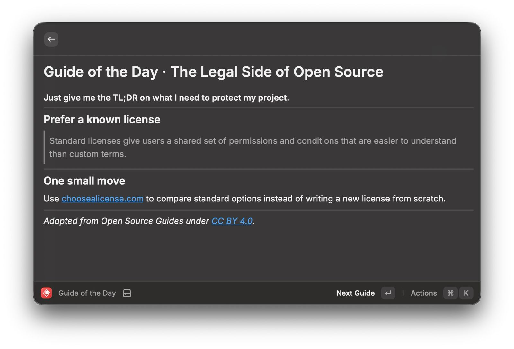
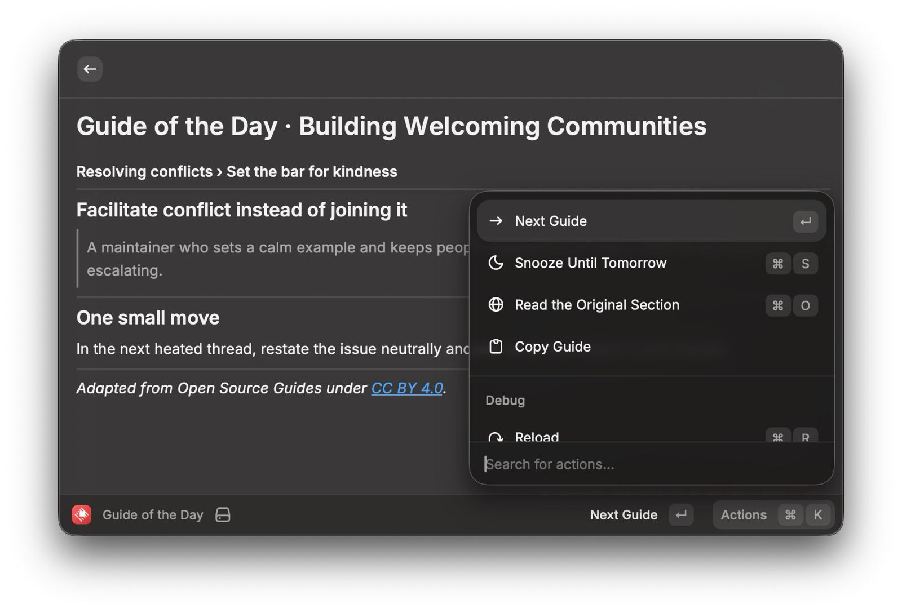
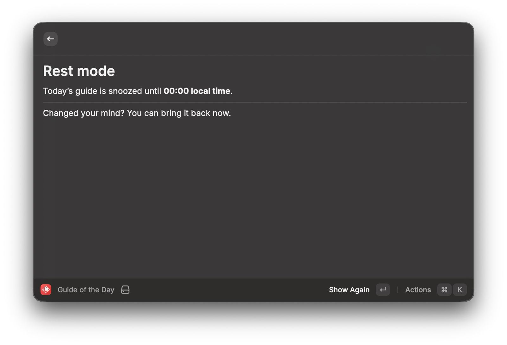

# OSS Guide of the Day

Open source has plenty of good advice. Remembering it is the hard part.

OSS Guide of the Day puts one short lesson in Raycast, where you already work. Read the idea, try one small action, then get on with your day.



## What you get

The extension includes 137 lessons based on all 13 English [Open Source Guides](https://opensource.guide/). A card tells you:

- which guide, section, and topic it came from
- the useful idea in a sentence or two
- one concrete thing to try

Press `↵` when you want another card. The order is shuffled but stable, so topics vary without jumping around at random each time you open Raycast. Your place is saved for the rest of the day.

Press `⌘ S` to snooze until midnight. If you change your mind, open the command and choose **Show Again**. Press `⌘ O` to read the original section.



## It works offline

The lessons ship with the extension. No account, feed, or extension server is involved. Reading a card and moving to the next one needs no internet connection.

The guide data and section index take about 104 KB uncompressed. Raycast stores only two small values on your device: today's position and the date you snoozed. Opening the original source is the only action that needs the internet.



## Where the writing comes from

These 137 cards are short adaptations of the [Open Source Guides](https://opensource.guide/), not copied passages. Each card points to the exact section behind it. `scripts/source-index.json` records the headings checked during the latest validation run.

The original guides belong to their authors and use the [CC BY 4.0 license](https://creativecommons.org/licenses/by/4.0/). Their source lives at [github.com/github/opensource.guide](https://github.com/github/opensource.guide). This extension uses the MIT license. That license does not cover third-party names, logos, or source material. Legal cards teach general concepts, not legal advice.

## Work on the extension

```sh
npm install
npm run dev
```

Check that source pages still exist, section links work, every guide has coverage, and no cards are duplicated:

```sh
npm run check-guides
```

Refresh the source index and section taxonomy:

```sh
npm run scrape-guides
```

The refresh script reads `robots.txt`, waits between requests, and keeps the card text separate from the scraped headings.
