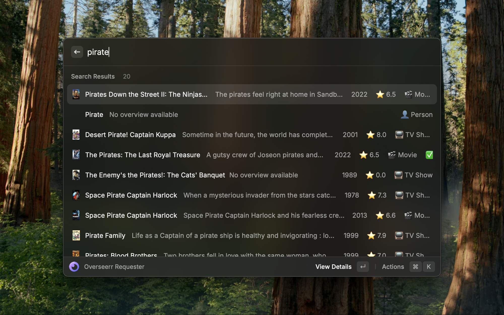
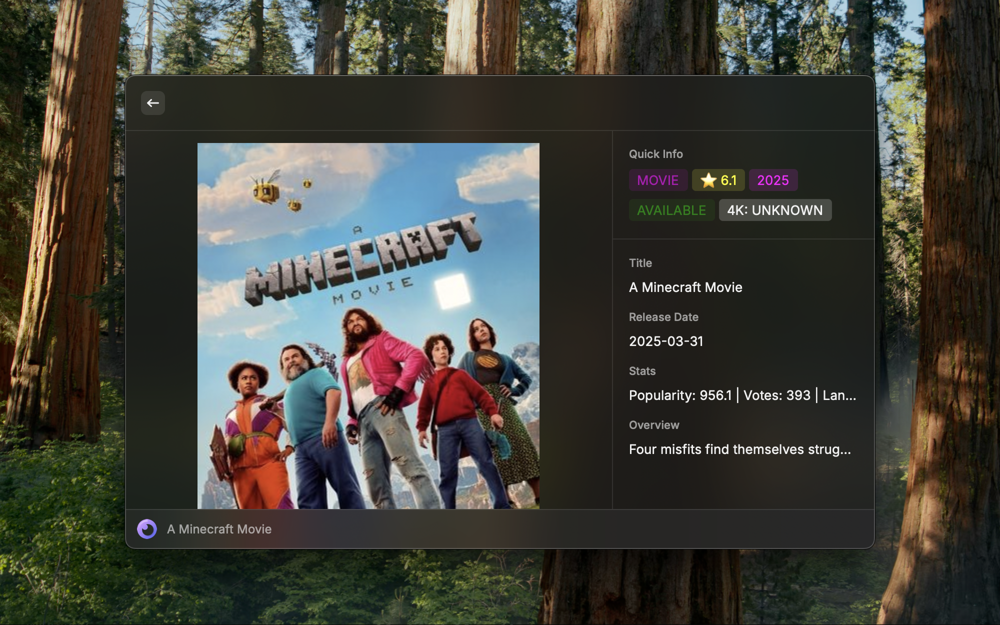
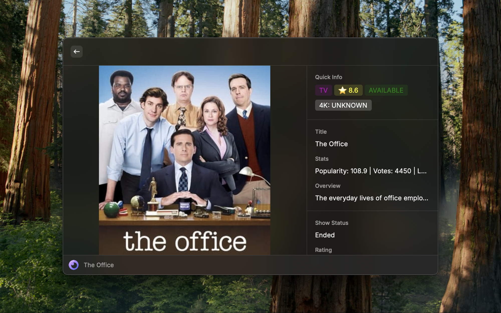
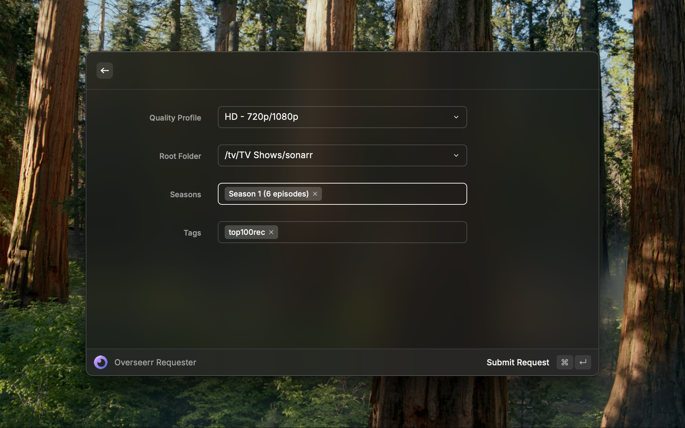
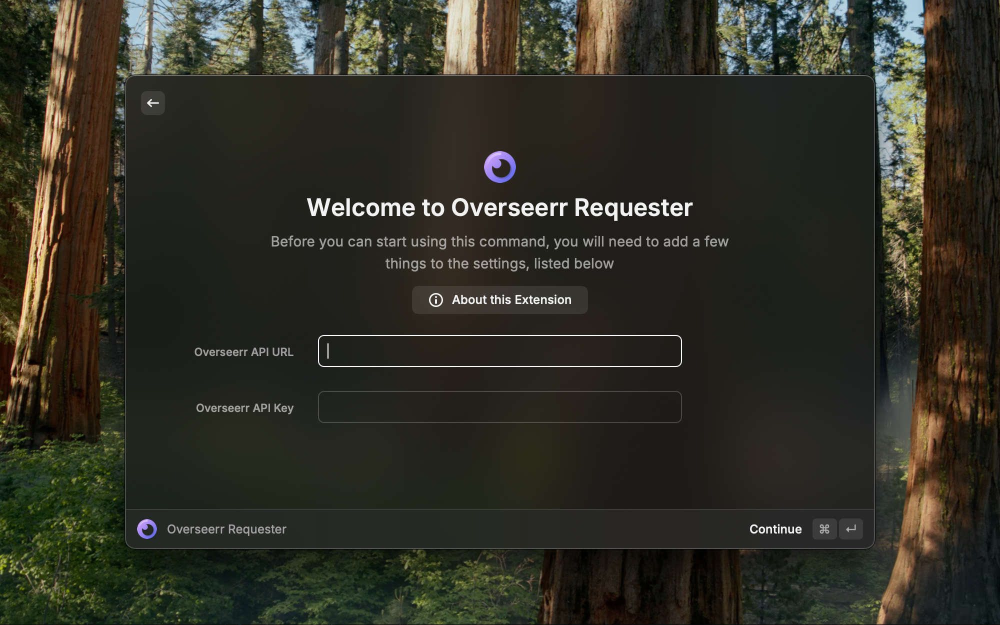

# Raycast Overseerr Requesterr

A Raycast extension for requesting media through Overseerr.

take a overseerr API key and URL and allows for searching for movies and tv shows. Checks download status and allows for making requests. Expects Overseerr integration with Radarr and Sonarr instances.

Future features to add:
- give movie/show page a open in imdb action
- add integration for plex info to open in plex
- add integration to open external radarr/sonarr link
- add editing request options
- look into adding plex integration to add to watchlist

## Screenshots

Here's a visual walkthrough of the extension in action:

*Search for movies and TV shows directly from Raycast*

*View detailed information about movies and TV shows*

*Check download and availability status*

*Make requests with customizable options pulled from radarr/sonarr instance through overseerr api*

*Configure your Overseerr connection settings*

