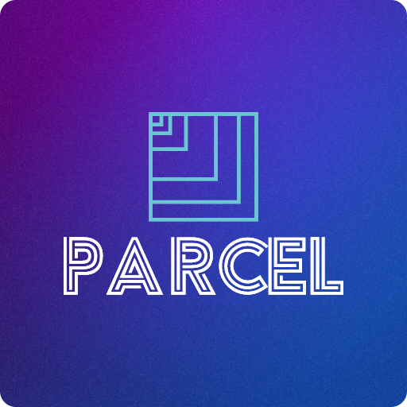

<h1>Parcel</h1>

A Raycast extension that allows you to track your packages using 17track's REST API.  All supported agencies are those of 17track.

## Installation

To install the extension, follow these steps:

Go to the [Raycast extension marketplace](https://raycast.com/extensions).
Search for "Package Tracker".
Click the "Install" button.

## Usage

To use the extension, you need to obtain an API key from 17Track. Follow these steps to get an API key:

1. Go to https://user.17track.net/en/ - create an account and log in
2. Once the account has been created go to https://api.17track.net/en/admin/settings and copy the Security Key
3. Paste it in the preferences and you are good to go!

## Features

- Allows you to track your parcels and packages using 17Track's API

## Support

If you have any issues or questions, please open an issue in the GitHub repository or contact me directly.
