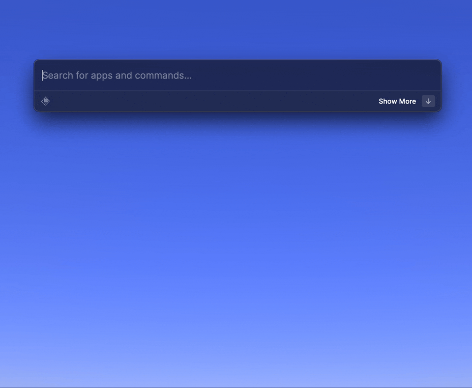

# Raycast Extension for PagerDuty

This extension helps you exploring recent PagerDuty incidents and acknowledge/resolve them quickly on Raycast.

# Setup

To get and update incident, PagerDuty API token is required.
You can get it on pagerduty.com by following [My Profile] -> [User Settings].
For more information, see https://developer.pagerduty.com/docs/ZG9jOjExMDI5NTUx-authentication .

# Limitations

Currently this extension has following limitations:

- only 25 recent incidents will be displayed (that is, paging is not implemented)

# Appendix

- Image Resources: [Brand | PagerDuty](https://www.pagerduty.com/brand/)
