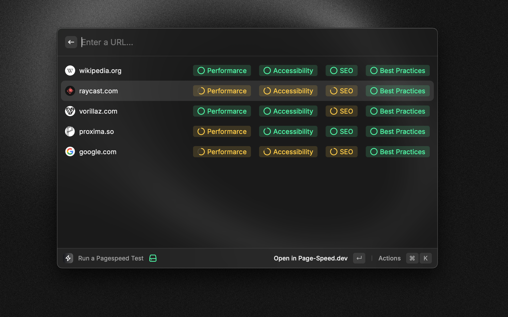
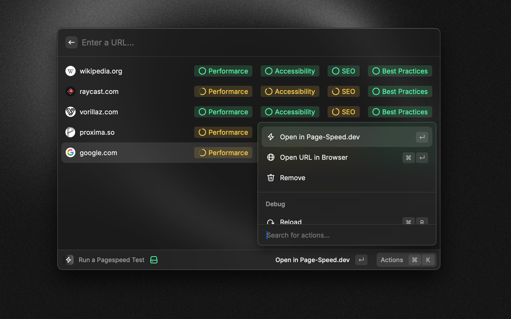
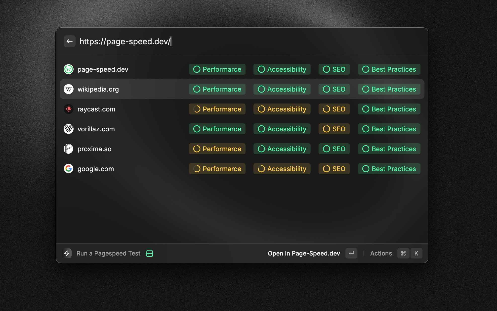

A simple Raycast extension to check the performance of a website using page speed insights from [page-speed.dev](https://page-speed.dev).

## Screenshots

## Credits

This extension is built on top of page-speed.dev API, kindly provided by [Daniel Roe](https://github.com/danielroe). The source code for the API can be found [here](https://github.com/danielroe/page-speed.dev)