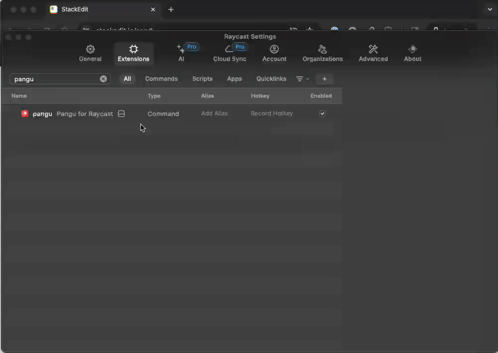

# Pangu for Raycast

Add spaces between Chinese and English, number or symbols using [https://github.com/vinta/pangu.js]().

## Usage

1. (Optional) Configure a shortcut for command `pangu` in Raycast Extensions.
2. Trigger the command using the shortcut or Raycast. The command will format the text you've selected on your screen, or format the content from your clipboard, then pastes it to the current cursor location.
