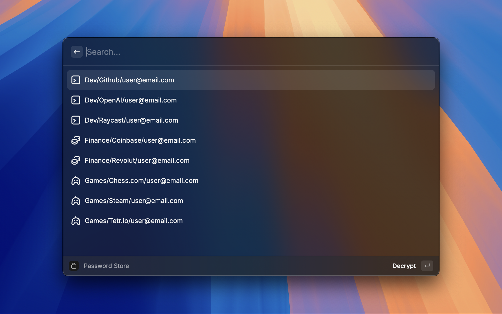
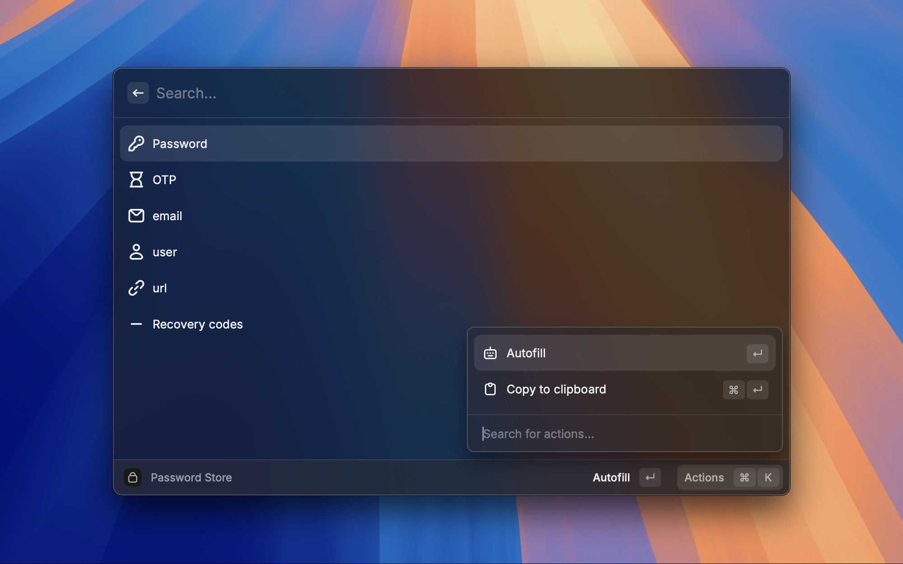

# Password Store

Raycast Extension for copying/pasting credentials from your password store (aka [pass](https://passwordstore.org)).
[pass](https://passwordstore.org) is a password manager inspired by the Unix philosophy. It has a command-line interface, and uses GnuPG for encryption and decryption of stored passwords.
This extension allows you to quickly copy/paste passwords using Raycast, without the need to spawn a new terminal.

## Configuration

- Password Store Location. Defaults to `~/.password-store`
- (optional) GPG decryption password. The extension needs to be able to decrypt your password store files. You can either save you password in your macOS Keychain or you can use this 'preference' to save your password in the Raycast Extension.

## Requirements

- [pass](https://passwordstore.org) cli tool installed and configured
- [pass-otp](https://github.com/tadfisher/pass-otp) extension installed (optional)

## Table of content

- [List View](#list-view)
- [Password Content View](#password-content-view)
- [Available Actions](#available-actions)

## List View

The first view of this extension shows all the password files (all the files ending in `.gpg` located in the `~/.password-store` directory)

If a password has already been used within the last **2 minutes** it will be displayed as the first option (regardless of the alphabetical order) to make it easier to access (ex. You just used the email for your Steam account, most probably you will also need your password right after that).


## Password Content View

After a password has been selected, the details view is shown.
The details view will contain the following options:

- Password: The first line of the decrypted file
- OTP: If the file contains an OTP URI (line starting with `otpauth://`) and the [pass-otp](https://github.com/tadfisher/pass-otp) extension is installed.
- For the remaining lines, if they follow the `Key: Value` format, a new entry will be added to the options using the `Key` as a title, and the `Value` as the value.

ex. password file:

```
this-is-a-password

url: https://example.com
email: user@email.com
user: user
otpauth://totp/totp-secret?secret=SECRET-OTP-CODE
Recovery codes: 000-000 000-000 000-000 000-000
```


If the last used options was the 'Password', the OTP options will be added as the **first option** to make it easier to access (ex. You just used the password for your Steam account. If an OTP field exists, most probably you will need your OTP right after that).


## Available Actions

The default behaviour when you select an option (by pressing the `Enter` key) is to 'paste' the value. The secondary option (using the `Cmd+Enter`) is to copy the value to your clipboard.

