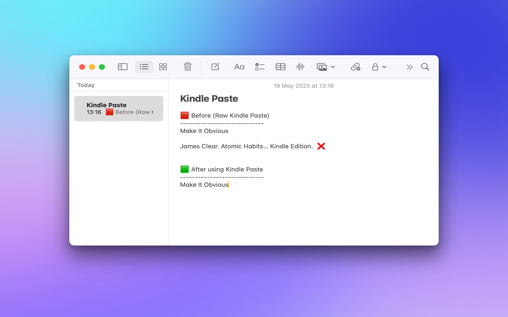

# Kindle Paste

Remove the automatic citation when copying from within the Kindle app

## Example Usage

⌘+c -> ⌘+v:
"text from kindle. [kindle citation]"

⌘+c -> Paste from Kindle: "text from kindle"

