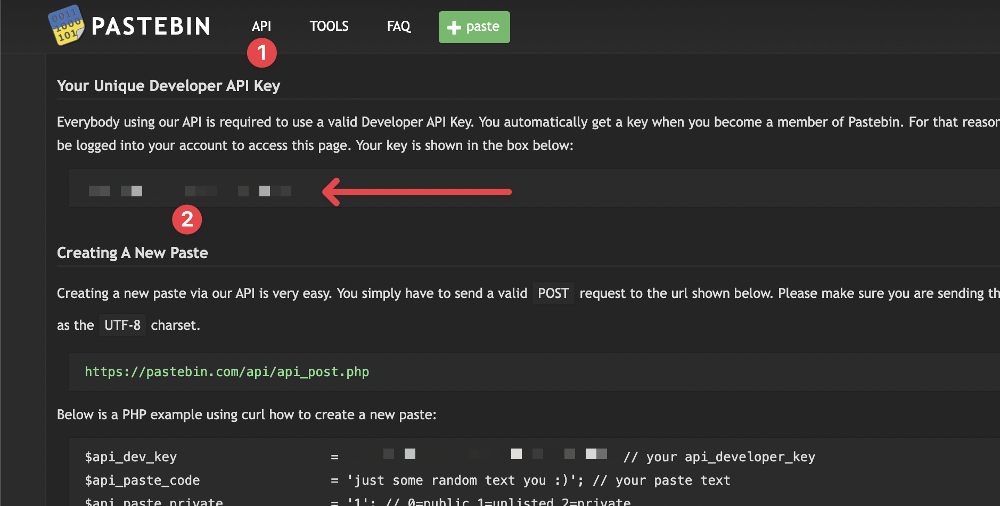

# Pastebin

Create, search and delete Pastebin pastes from Raycast.

## Installation

To get the API key for Pastebin, you need to register an account at [pastebin.com](https://pastebin.com/signup).
After login in, you can get the API key [here](https://pastebin.com/doc_api).

If you don't have a password because you used a social provider, you can visit
the [change password page](https://pastebin.com/user/password) to set one.