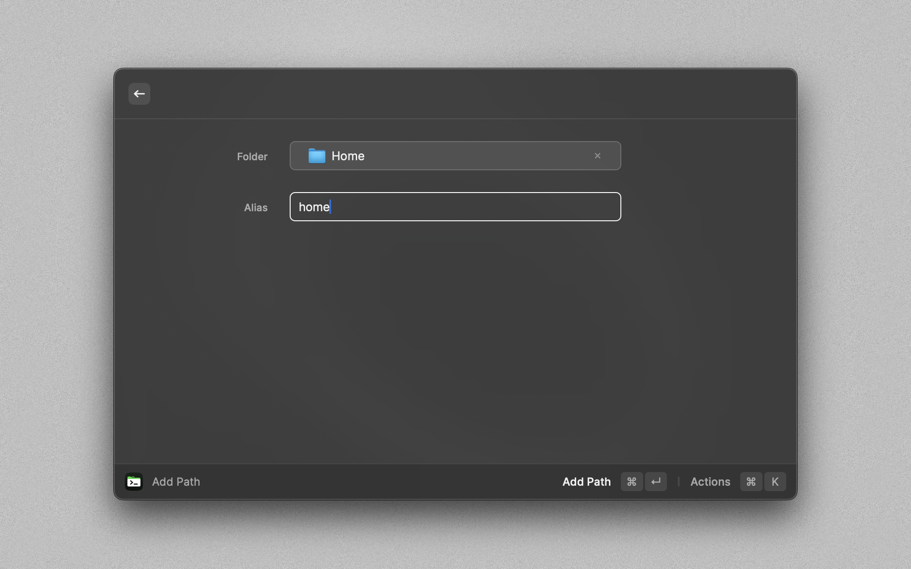

# Path Manager Raycast Extension

Path Manager allows you to easily manage and navigate to various file paths on your system. With a simple and intuitive interface, you can add, list, and open paths with aliases for quick access.

## Features

### Add Path

Store a directory path with an alias for easy access later. Simply input the full directory path and assign an alias. The path is then saved to a local database or file for later use.

- **Inputs**:
  - `Path`: The full directory path you want to save.
  - `Alias`: A shorthand or nickname for the path.

### List Paths

View all your saved paths and their aliases. Provides a search function to quickly locate a path, along with options to go to the path in the terminal, delete, edit, or add new paths.

### Go To Path

Open a terminal tab navigating to the chosen path. Enter the path alias or the path you want to navigate to, and the extension takes care of the rest.

- **Inputs**:
  - `Alias` or `Path`: The alias of the path or full path you want to open.

## Configuration

Upon installation, Path Manager supports both the default terminal and iTerm. You can configure your preference in the extension settings within Raycast.
