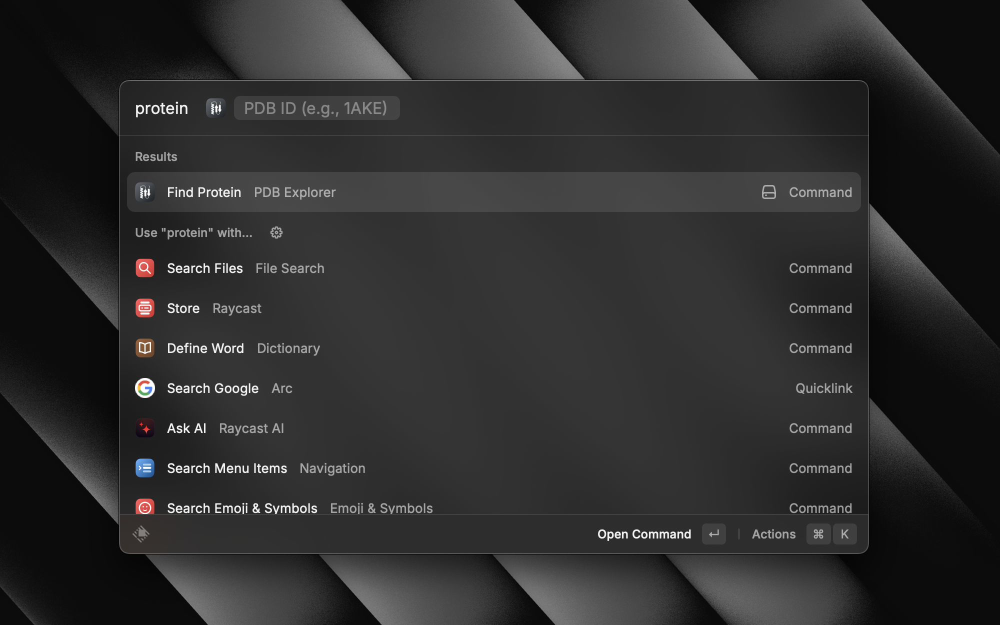
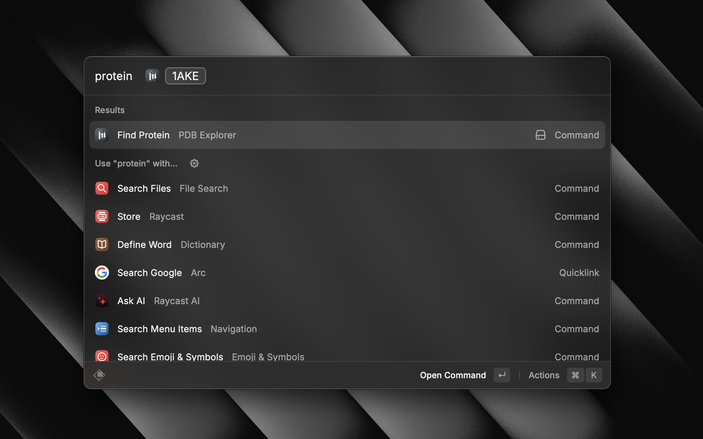
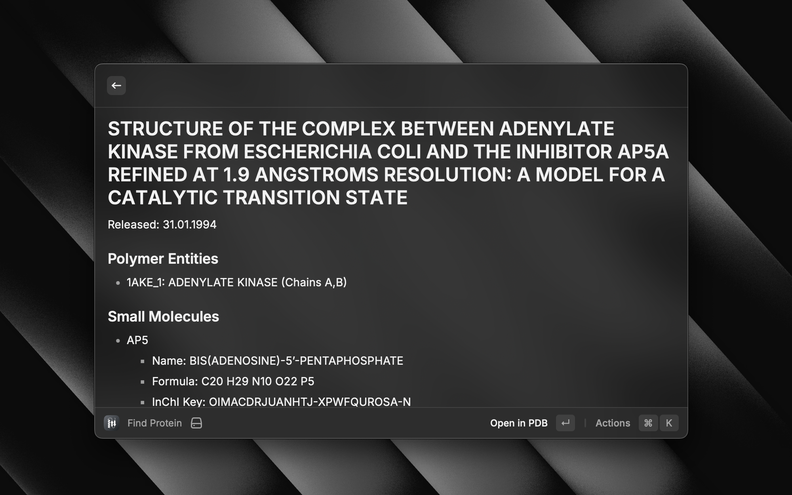

# Protein Structure Viewer for Raycast

A Raycast extension to quickly view and access protein structure information from the [RCSB Protein Data Bank (PDB)](https://www.rcsb.org/).

## Features

- Search for proteins using their PDB ID
- View detailed protein information including:
  - Protein title and release date
  - Polymer entities with chain information
  - Small molecule details (ligands) including:
    - Chemical names
    - Molecular formulas
    - InChI Keys
- Quick actions:
  - Open protein structure in PDB website
  - Copy PDB URL
  - Copy PDB ID
  - Copy protein title

## Usage

1. Open Raycast
2. Search for "Find Protein"
3. Enter a valid PDB ID (e.g., "1AKE")
4. View the protein information

## Keyboard Shortcuts

- `⌘ + O` - Open protein in PDB website
- `⌘ + .` - Copy PDB URL
- `⌘ + ⇧ + .` - Copy PDB ID
- `⌘ + ⌥ + .` - Copy protein title

## Data Source

This extension uses the RCSB PDB GraphQL API to fetch protein structure information. All data is retrieved from [RCSB Protein Data Bank](https://www.rcsb.org/).

## Requirements

- [Raycast](https://www.raycast.com) v1.51.1 or higher (might work on older versions, but not tested)

## Installation

1. Open Raycast
2. Search for "Extension Store"
3. Search for "Protein Structure Viewer"
4. Click Install

## Screenshots

Open Protein Structure Viewer Extension

Search for protein

View protein details

Quick actions

## License
MIT License

