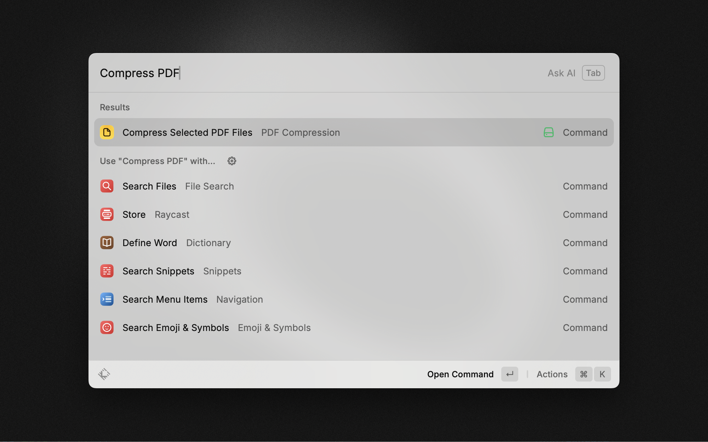
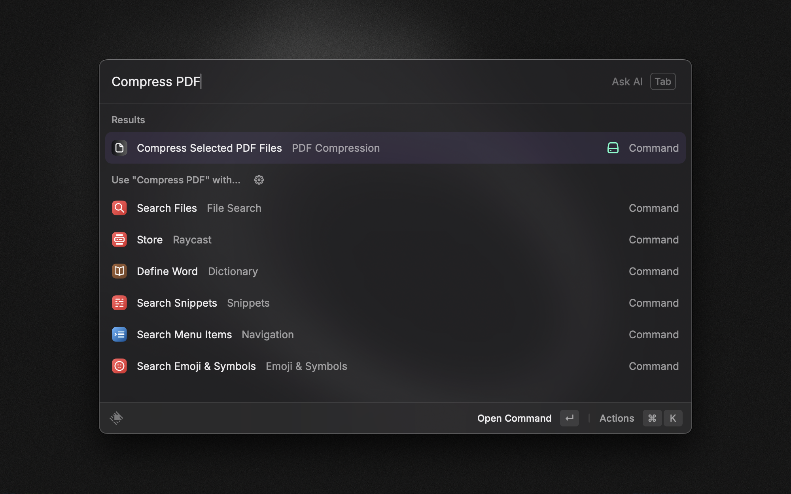

# PDF Compression

Efficient PDF Compression using native macOS API [PDFKit](https://developer.apple.com/documentation/pdfkit). The usage of the extension does not require any additional software installation nor the usage of any third party services.

Be aware that the compression is based on complete rasterization of the PDF pages, which converts pages to images that may reduce text quality and searchability.

## Usage

1. Select the PDF files you want to compress in Finder
2. Run the command
3. The compressed PDF files will be saved in the same directory as the original files, with `- compressed` appended to the filename

## Screenshots

## License

[MIT](LICENSE)