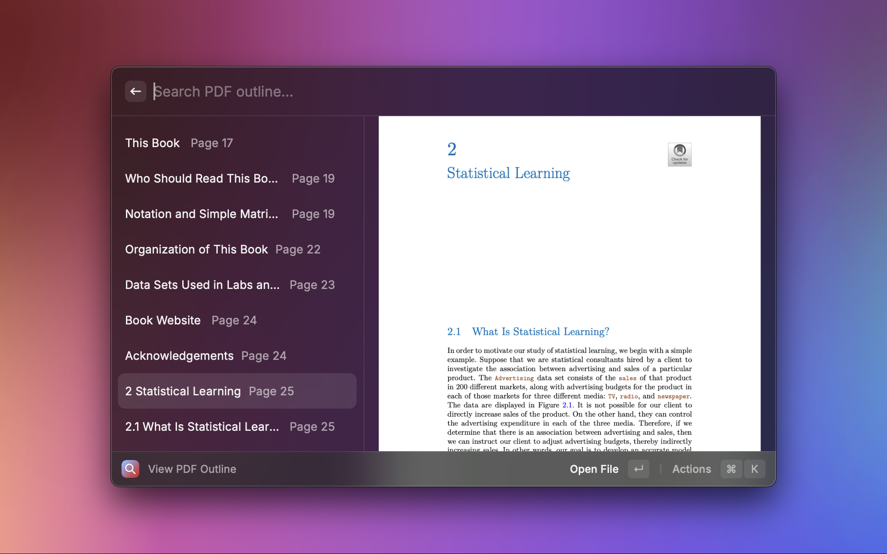

# PDFSearch

Raycast extension for performing search across groups of selected PDF documents. It uses PDFKit to perform keyword search for all files within the collection, extracts the paragraph the matches are contained in, then reranks the paragraphs based on its semantic similarity with the search query.

## Creating and Editing Collections

Create a collection by naming and selecting a group of PDF files/directories from finder, which can also be removed from the collection. You can also edit existing collections. Note that collection names have to be unique.

## Search Collection

When a collection selected, you will be brought to a page where you can enter your search query, which will be used to search all files within the collection. Selecting any of the results will open the PDF document and navigate to the page that contains the query at the location that matches. You can also preview the document using quick look, or show the file in finder.

## Outline Search

The View Outline command allows you to open a selected pdf file and view/filter the different sections of the selected PDF file.

