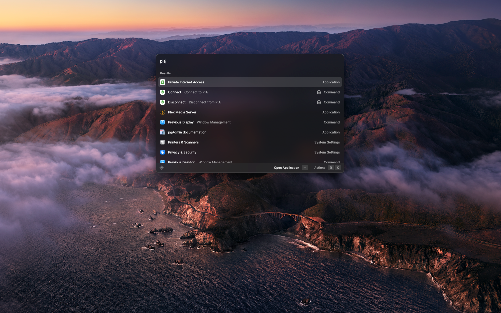

# Private Internet Access

PIA Controls is a simple extension that allows you to control your Private Internet Access VPN connection from within Raycast. Ensure you have [Private Internet Access](https://www.privateinternetaccess.com/) installed.

## Commands
### Connect
Launches the PIA app and connects to the VPN.

### Disconnect
Disconnects the VPN.