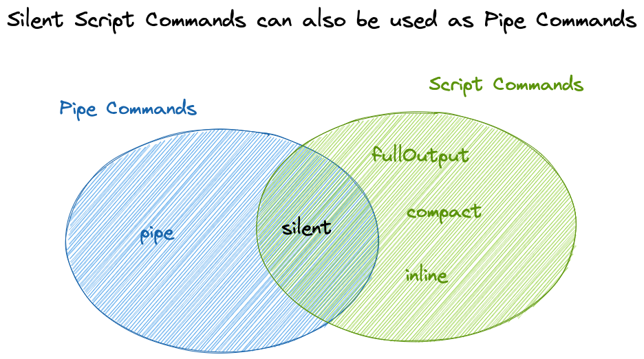

# Raycast Pipe Commands

## Using Pipe Commands

Select / Copy some text and use the `Pipe [Selection, Clipboard] to Command` command.

## Adding Additional Pipe Commands

Use the `Create Script Command` command to generate a new script command, then change the `@raycast.mode` value to `pipe`.

The Pipe command syntax is very similar to the [script command syntax](https://github.com/raycast/script-commands/blob/master/README.md), with some caveats:

- The `mode` field must be set to pipe.
- The `refreshTime`, `argument1`, `argument2`, `argument3` fields are not supported and will be ignored.
- A new `input` field is available to specify the input type. It can be `text` (default), `file` or `tab`.



## Pipe Mode Logic

The user input (text selection or clipboard) will be passed as stdin.
If it is not empty, the standard output stream of the script will be copied to the clipboard or replace the current selection depending on the user choice.

## Supported Script Commands

The `silent` script commands with a single argument are supported. The user input will be used as first argument to the script.

## Example Commands

### Google Search

```bash
#!/bin/bash

# @raycast.schemaVersion 1
# @raycast.title Google Search
# @raycast.packageName Web Searches
# @raycast.mode silent
# @raycast.icon 🌐
# @raycast.argument1 {"type": "text", "percentEncoded": true, "placeholder": "Query"}

# Open the url in the default browser
open "https://www.google.com/search?q=$1"
```

### Format JSON

```python
#!/bin/bash

# @raycast.schemaVersion 1
# @raycast.title Prettify JSON
# @raycast.packageName Developer Utils
# @raycast.mode pipe
# @raycast.inputType text
# @raycast.icon 🔨

python3 -m json.tool --indent 2
```
