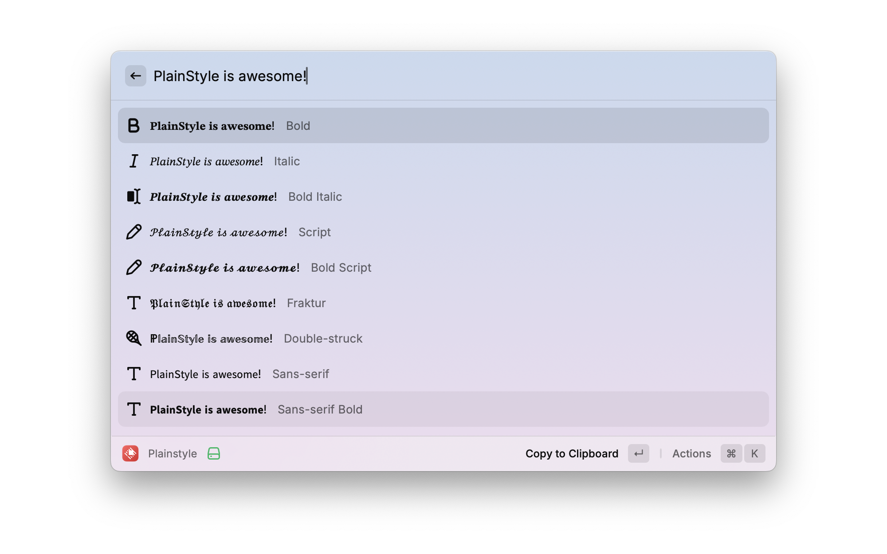

# PlainStyle

Transform your text into various Unicode styles instantly. This Raycast extension allows you to convert regular text into different font styles using Unicode characters, making your text stand out in any context.

## Features

- 🎯 **Instant Conversion**: Convert text as you type
- 🔄 **Multiple Styles**: Support for various Unicode text styles:
  - 𝐒𝐞𝐫𝐢𝐟 𝐁𝐨𝐥𝐝
  - 𝑆𝑒𝑟𝑖𝑓 𝐼𝑡𝑎𝑙𝑖𝑐
  - 𝑺𝒂𝒏𝒔 𝑺𝒆𝒓𝒊𝒇
  - 𝓢𝓬𝓻𝓲𝓹𝓽
  - 𝔉𝔯𝔞𝔨𝔱𝔲𝔯
  - 𝕄𝕠𝕟𝕠𝕤𝕡𝕒𝕔𝕖
  - And more!
- 📋 **Clipboard Integration**: Easily copy converted text
- ⚡️ **Performance**: Optimized for speed with minimal resource usage

## Installation

1. Install [Raycast](https://raycast.com/)
2. Open Raycast
3. Search for "PlainStyle" in the Raycast Store
4. Click Install

## Usage

1. Open Raycast with your shortcut
2. Type "style" or "style text"
3. Enter your text
4. Select your desired style from the list
5. Press Enter to copy the styled text to your clipboard

## Screenshots

## Contributing

Contributions are welcome! Here's how you can help:

1. Fork the repository
2. Create your feature branch (`git checkout -b feature/amazing-feature`)
3. Commit your changes (`git commit -m '✨ Add some amazing feature'`)
4. Push to the branch (`git push origin feature/amazing-feature`)
5. Open a Pull Request

## License

This project is licensed under the MIT License - see the [LICENSE](LICENSE) file for details.
