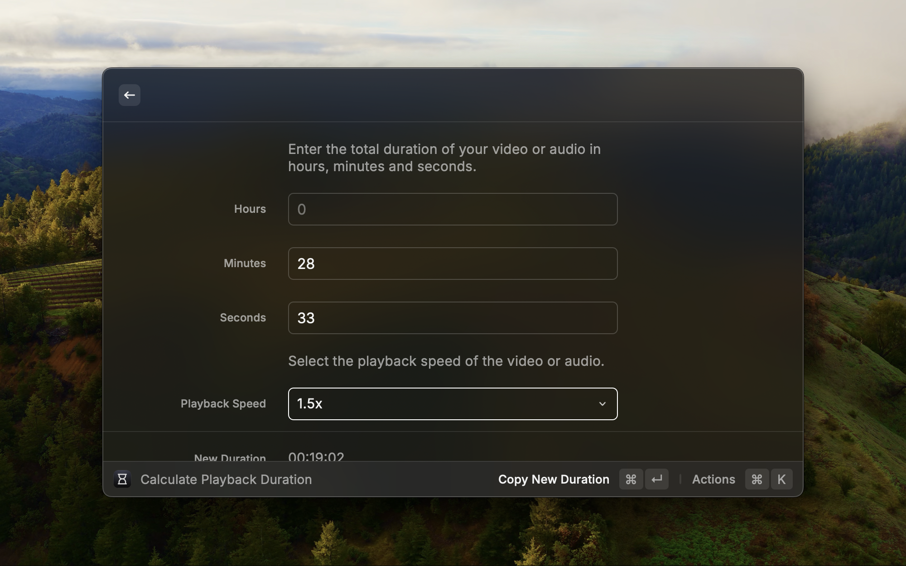
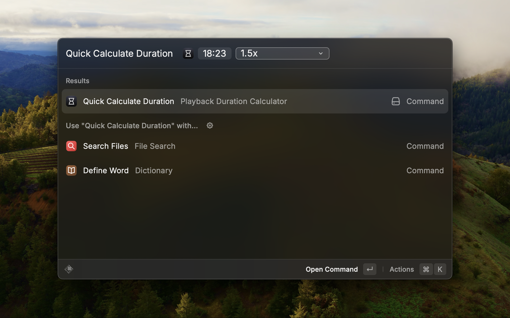

<h1 align="center">Playback Duration Calculator</h1>
<h3 align="center">Find out how long your video or audio will take to finish based on your playback speed.</h3>

## Features

- Get the new duration, time saved, and completion time of your video or audio based on your selected playback speed
- Quickly check the new duration of your video or audio straight from the command bar
- Set your favorite playback speed as default to calculate new durations faster
- Easily copy results to your clipboard with keyboard shortcuts
