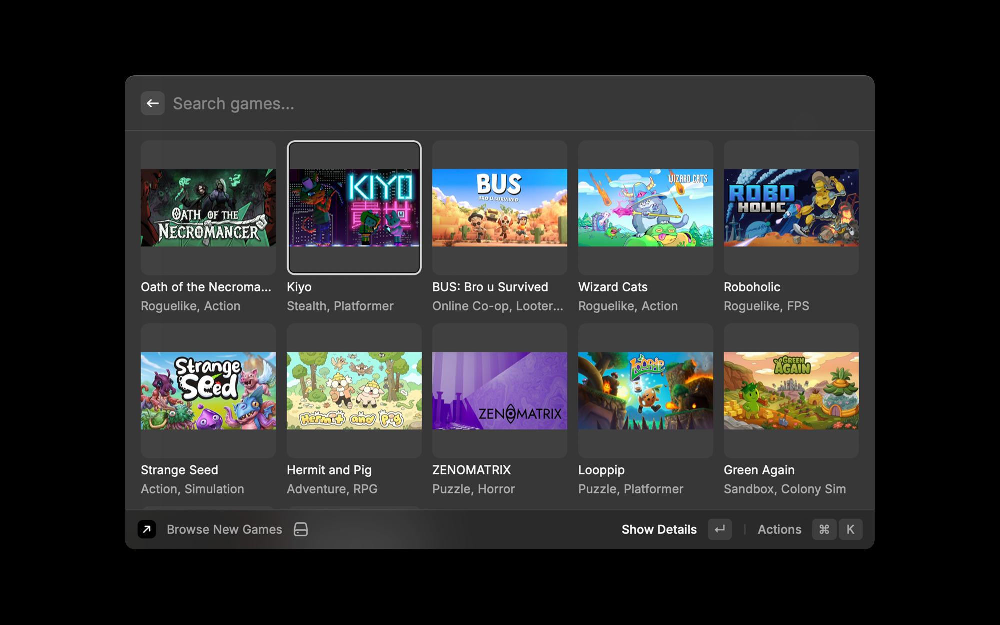
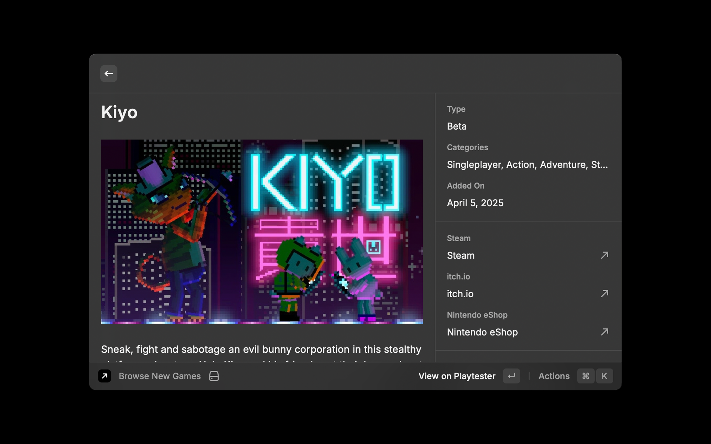
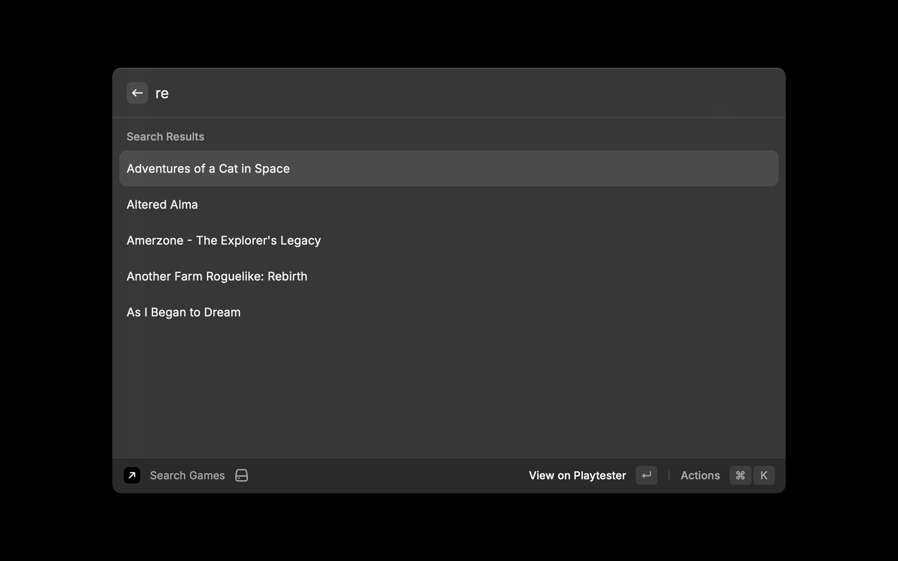
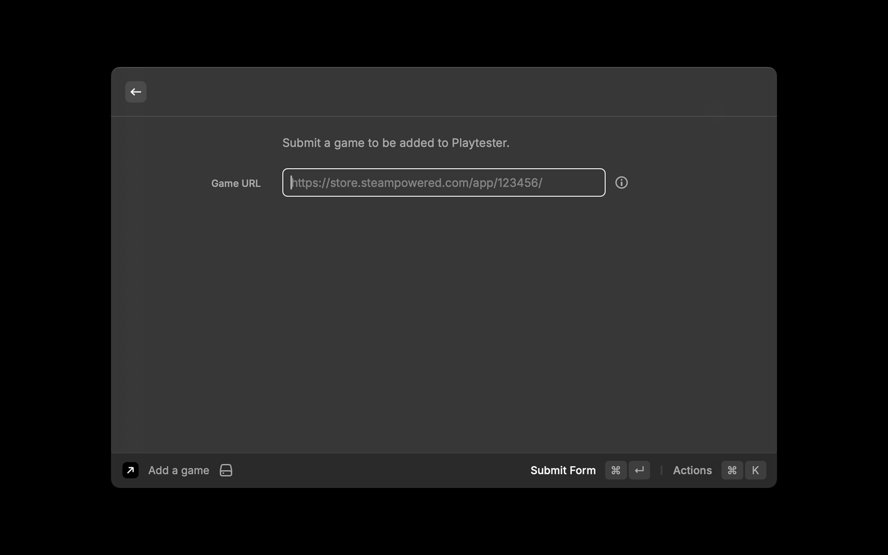

# Playtester

Discover alphas, betas, demos for upcoming indie games on Steam, PlayStation, Xbox, and other platforms.

## Features

### Browse New Games

- View the latest indie games in a visual grid
- See game titles, categories, and thumbnails at a glance
- Click for detailed information including platforms, release dates, and descriptions
- Open games directly in your browser

### View Game Details

- Learn more about a specific game
- See game titles, categories, and thumbnails, platforms, type
- Open games directly in your browser

### Search Games

- Search for specific indie games by title
- Get instant results as you type
- See trending games automatically
- One-click access to game details

### Submit Games

- Submit new games to the Playtester database
- Support for multiple platforms including Steam, PlayStation, Xbox, Nintendo, Epic, and mobile stores
- Automatic validation of game URLs
- Instant feedback on submission status

## Usage

### Finding New Games
1. Open the "Browse New Games" command
2. Browse the visual grid of recently added games
3. Use the search bar to filter by title or category
4. Click on a game to see detailed information
5. Open the game page directly on Playtester or its platform store

### Searching for Games
1. Open the "Search Games" command
2. Type in the name of a game you're looking for
3. Results appear as you type
4. Click on a result to open it on Playtester

### Submitting a Game
1. Open the "Submit Game" command
2. Enter the store URL for the game (Steam, PlayStation, etc.)
3. Submit the form
4. Receive immediate feedback on your submission

## About Playtester

[Playtester.io](https://playtester.io) is a platform that helps indie game developers connect with players for early feedback on their games. The service tracks upcoming indie games across various platforms and connects developers with eager playtesters.

This Raycast extension provides quick and convenient access to Playtester’s database of indie games right from your desktop.
