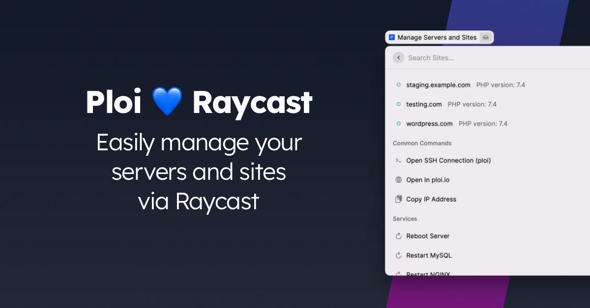
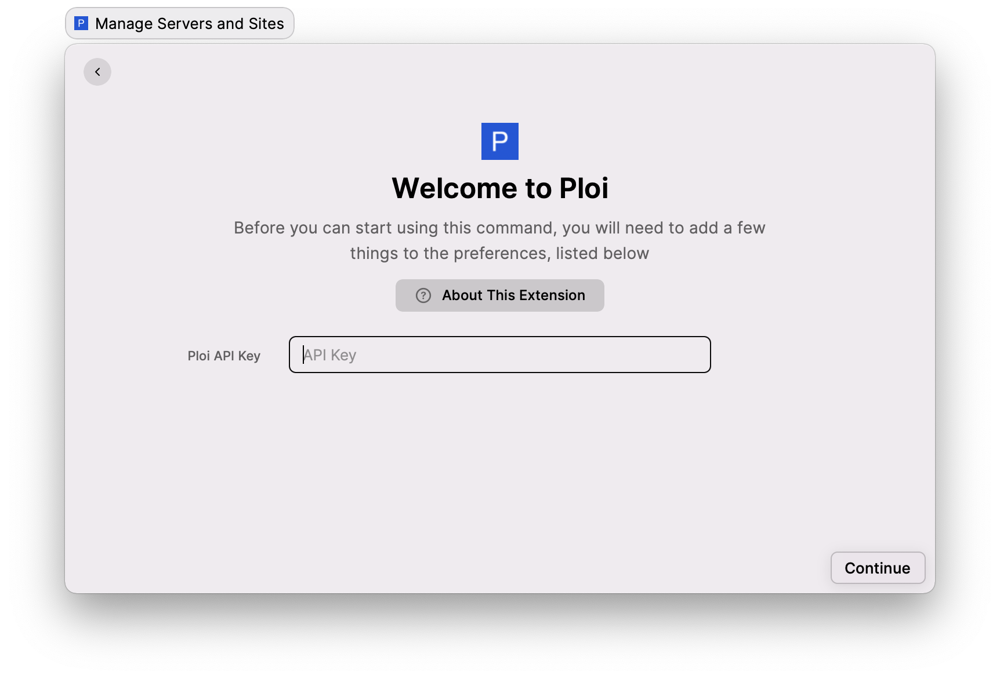

# Ploi Raycast

A Raycast plugin for managing your servers & sites by [Ploi](https://ploi.io/).



## Usage

You will need an API key from Ploi to use this extension.
When logged in, [visit this page](https://ploi.io/profile/api-keys) to create a fresh API key.

Make sure to tick the required permissions and copy the token, next you can enter that token inside Raycast to make it work.



## Features from Ploi API

- View site details
- View deployment status
- Trigger deploy script
- Restart services (NGINX, MySQL, Supervisor)
- Restart server
- Flush FastCGI cache
- Refresh server OPcache

## Non-Ploi API Features

- Open terminal session
- Copy IP address
- Open site or server in ploi.io

## Development

1. Clone repository

```
$ git clone https://github.com/ploi-deploy/ploi-raycast.git
```

2. Install dependencies

```
$ npm install
```

3. Run development

```
# Development
$ npm run dev
```

## Production

Making sure production building works and compiles with Raycast:

```
$ npm run lint
$ npm run build
```

## Links

- **Website** - https://ploi.io
- **API Documentation** - https://developers.ploi.io

## Contributors

- [Dennis Smink](https://github.com/Cannonb4ll)
- [Robin Rosiers](https://github.com/RosiersRobin) (Initial creator)
- [Kevin Batdorf](https://github.com/KevinBatdorf) (Inspiration 💙)
- [xmok](https://github.com/xmok)