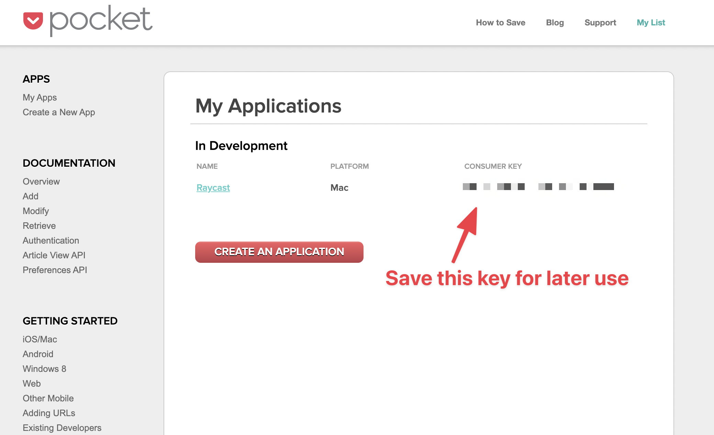
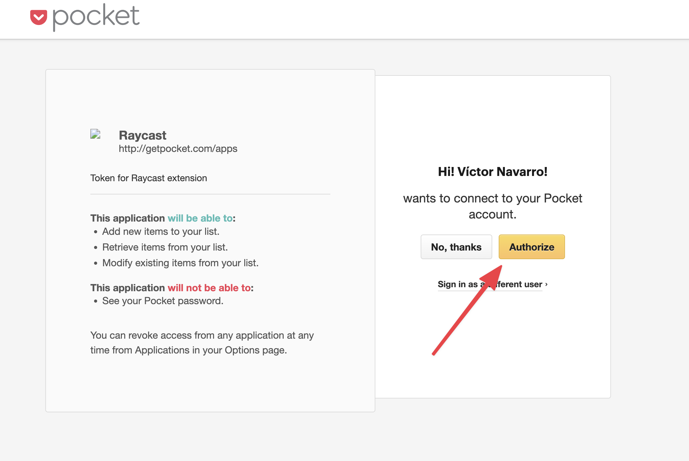

# Pocket

## Installation

Below on how to get the necessary information for the extension. Make sure you replace the
strings `YOUR_APP_CONSUMER_KEY`,
`YOUR_ACCESS_TOKEN` and `YOUR_REQUEST_TOKEN` with the actual values.

First you will need to create a Pocket app [here](https://getpocket.com/developer/apps/).

After that you will need to copy the consumer key:



Then run the following code in your terminal replacing `YOUR_APP_CONSUMER_KEY` with the value you got in the previous
step.

```shell
curl --location --request POST 'https://getpocket.com/v3/oauth/request' \
--header 'Content-Type: application/json' \
--data-raw '{
    "consumer_key": "YOU_APP_CONSUMER_KEY",
    "redirect_uri": "https://google.com"
}'
```

This will respond with the following:

```
code=YOUR_REQUEST_TOKEN
```

Copy the `YOUR_REQUEST_TOKEN` value and use it to open the following URL in our browser:

```
https://getpocket.com/auth/authorize?request_token=YOUR_REQUEST_TOKEN&redirect_uri=https://google.com
```

This will open an authorization screen, simply press the `Authorize`.



Finally, you just need to run the following code in your terminal to get the access token:

```shell
curl --location --request POST 'https://getpocket.com/v3/oauth/authorize' \
--header 'Content-Type: application/json' \
--data-raw '{
    "consumer_key": "YOUR_APP_CONSUMER_KEY",
    "code": "YOUR_REQUEST_TOKEN"
}'
```

This will respond you with the following:

```
access_token=YOUR_ACCESS_TOKEN&username=victor%40vimtor.io
```

Now you can fill all the necessary fields in the extension settings.