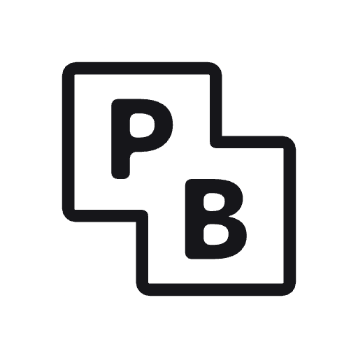

    

# PocketBase

View [PocketBase](https://pocketbase.io/) Collections and View Records.

This extension requires you to log in as an **Admin**.

## # Supported Version

1. **v0.22.***

---

Looking for more infra extensions? Try these:

