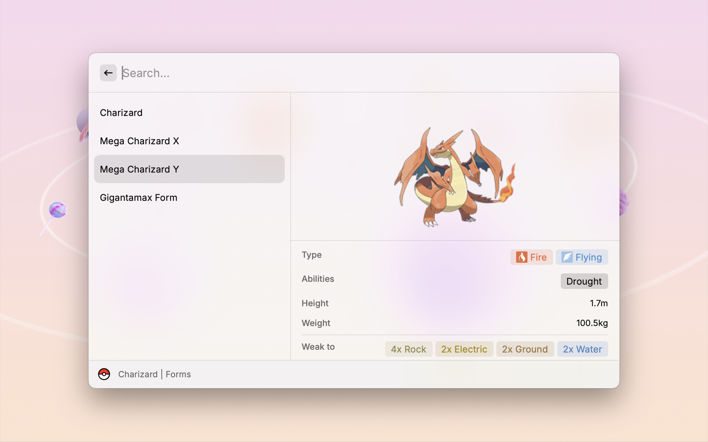

  
  <h1 align="center">Pokédex</h1>

A Raycast extension that lets you search for Pokémon by name or National Pokédex number.

This extension is created by [Anh Thang Bui](https://github.com/anhthang) and utilizes data from [PokéAPI](https://pokeapi.co/).

## Features

* **Comprehensive Pokémon Search:** Search for all 1025 Pokémon species, including alternate forms like regional variants (Alolan, Galarian, Hisuian, Paldea), Mega Evolution, and Gigantamax.
* **Detailed Pokédex Entries:** Access information on Pokédex data, base stats, type effectiveness, training, breeding, forms, evolutions, Pokédex entries, learnset, and locations.
* **Actionable Links:** Open Pokémon in the Official Pokémon Website or Bulbapedia directly from the extension.
* **Type Filtering:** Filter Pokémon by their type for a focused search.
* **Customizable Language:** View Pokémon details in your preferred language (English, French, German, Italian, Japanese, Korean, Spanish, Chinese Simplified & Traditional).

## TODO

* Implement support for Egg moves.
* Integrate Pokémon sprites.

## Issues

Report bugs or suggest improvements by creating an issue [here](https://github.com/anhthang/raycast-pokedex/issues).

## Credits

* Pokémon type and sort icons: [Zukan](https://zukan.pokemon.co.jp/)
* Pokémon move damage class: [Smogon](https://www.smogon.com/dex/ss/moves/)
* Bulbapedia icon: [Bulbagarden](https://bulbagarden.net/)