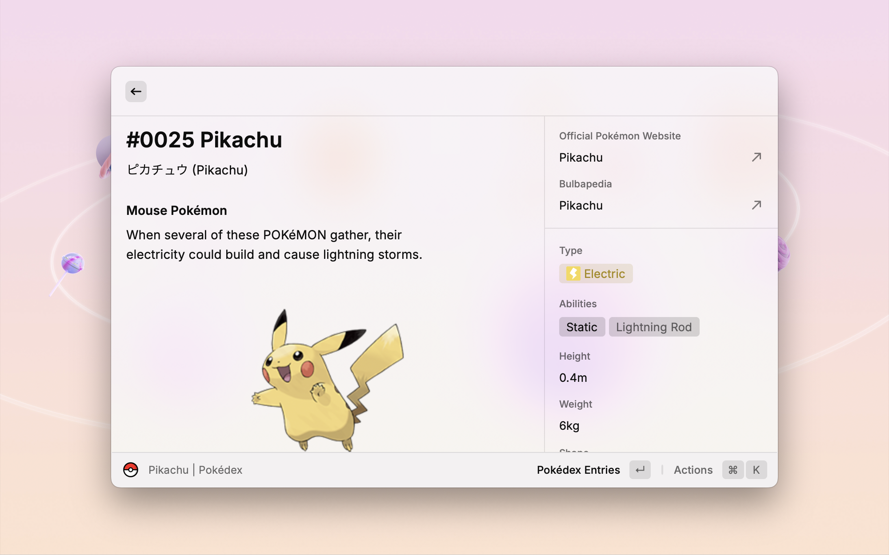

  <h1 align="center">Pokédex</h1>

Explore the world of Pokémon with stunning visuals and detailed information in Raycast.

## Features

### Core Functionality
* **Comprehensive Pokémon Database:** Access information on all 1025 Pokémon species, including regional variants, Mega Evolutions, and Gigantamax forms.
* **Detailed Pokédex Entries:** Explore in-depth details about Pokédex data, stats, types, training, breeding, evolutions, learnsets, and locations.
* **Enhanced Move Information**: Access detailed information about Pokémon moves, including base power, accuracy, PP, type, category, priority, target, and more.
* **Quick Links:** Easily access Pokémon on the Official Pokémon Website or Bulbapedia with direct links.

### Customization Options
* **Language Preferences:** Choose your preferred language for Pokémon details (English, French, German, Italian, Japanese, Korean, Spanish, Simplified & Traditional Chinese).
* **Type Filtering**: Narrow down your search by selecting specific Pokémon types.
* **Sorting Flexibility:** Sort the Pokédex by Pokémon name or National Pokédex number to suit your preferences.
* **Artwork Selection:** Customize the Pokémon artwork to match your style:
  * **Official Artwork:** View the classic, official Pokémon designs.
  * **Pixel Art:** Experience a nostalgic touch with pixelated Pokémon sprites.

### Performance Optimization
* **Efficient Caching:** Benefit from a caching system that stores frequently accessed Pokémon data, improving load times and reducing API usage.

## TODO

* Integrate Pokémon sprites.

## Issues

Report bugs or suggest improvements by creating an issue [here](https://github.com/anhthang/raycast-pokedex/issues).

## Credits

**Pokémon:**

* Data: [PokéAPI](https://pokeapi.co/)
* Official Artwork & Sprites (Up to National Dex #649): © Nintendo/The Pokémon Company/GAME FREAK Inc.
* Pixel Art Sprites (National Dex #650 and above): [Smogon community](https://www.smogon.com/forums/threads/smogon-sprite-project.3647722/) (special thanks for their contributions), [Smogon Sprite Project Spreadsheet](https://docs.google.com/spreadsheets/d/1acgzAjh0dnFRQnjZu8kSjS177rKCzpFfEHRLtwuuXRU/edit?gid=0#gid=0)
* Generation 9 Sprites: [KingOfThe-X-Roads](https://www.deviantart.com/kingofthe-x-roads)

**Icons:**

* Pokémon Types and Sorting: [Zukan](https://zukan.pokemon.co.jp/)
* Pokémon Move Damage Class: [Smogon](https://www.smogon.com/dex/ss/moves/)
* Bulbapedia: [Bulbagarden](https://bulbagarden.net/)
