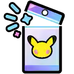
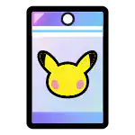

#  Pokémon TCG Pocket Binder

##  Features

 Visualize every card in the game, its rarity, ID, and every edition available.

 Check the cards obtainble in every pack and decide which one to open next for specific cards.

## Contributing

If you have any cool ideas, suggestions or find any bugs, feel free to create an issue or submit a pull request.
Check out the [Raycast Developers Documentation](https://developers.raycast.com/basics/contribute-to-an-extension) to know how to contribute to an Extension.

## License

This project is under the MIT License. Check out the [LICENSE](LICENSE) file for more details.

## Acknowledgements

All card images used are © The Pokémon Company, Nintendo, and DeNA. All rights reserved.

## Connect with Me

Happy collecting! 🎉
