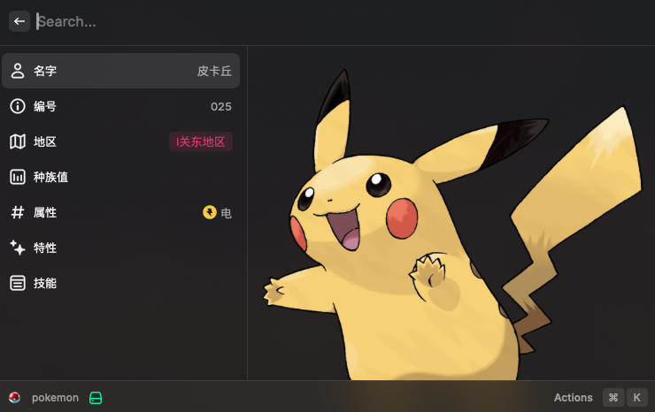
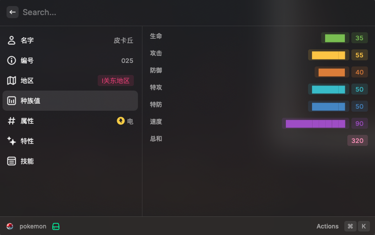
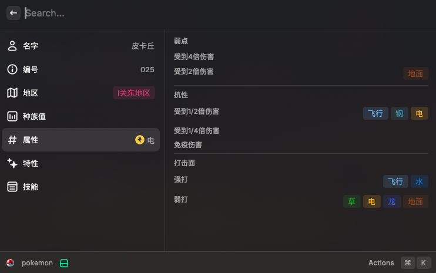
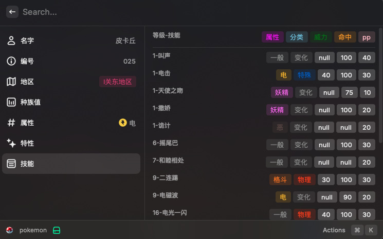

# 
Pokemon!

 

查询特定宝可梦的详细数据，适合新手训练师查询/老训练师回忆。常用常更新~

> 业余程序猿，面向gpt开发，仅支持中文。

## Screenshot

- 首页

- 种族值

- 属性

- 技能

## Features

- 宝可梦名字（输入参数，要求是官方译名，否则查询会报错）& 高清大图
- 全国图鉴编号
- 所属世代/地区
- 种族值详情
- 属性，及其弱点、抗性、打击面
- 特性（包含隐藏特性）
- 技能列表（升级可学技能，默认最新世代，暂不包括招式学习器）

## TODO
- 进化信息
-  UI美化
-  种族值标签
