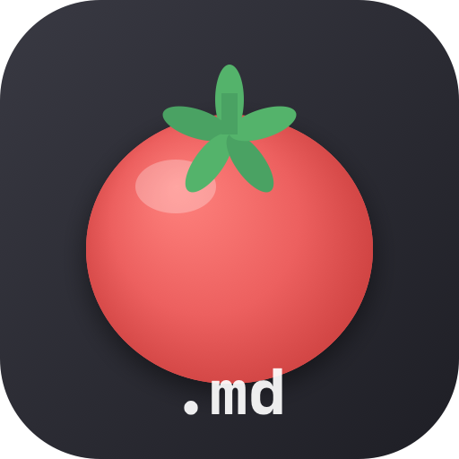
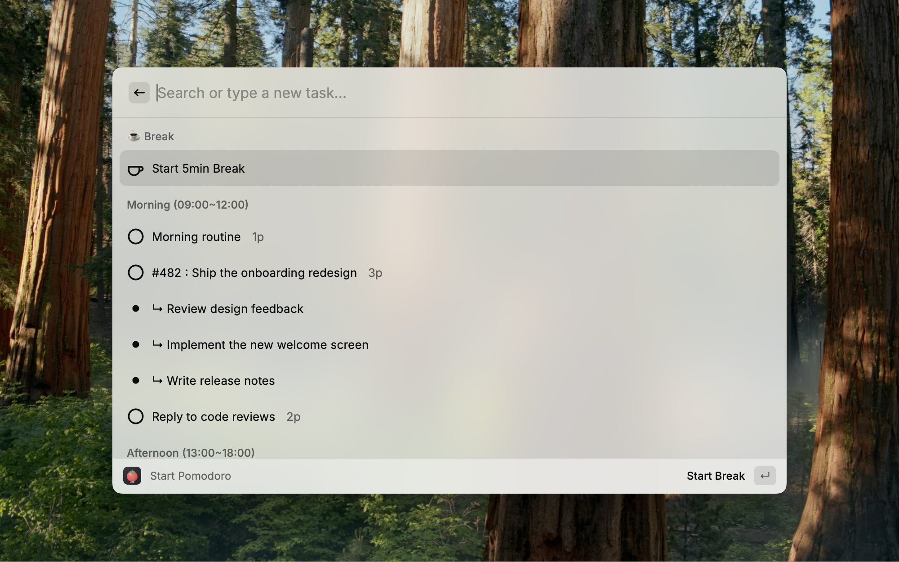
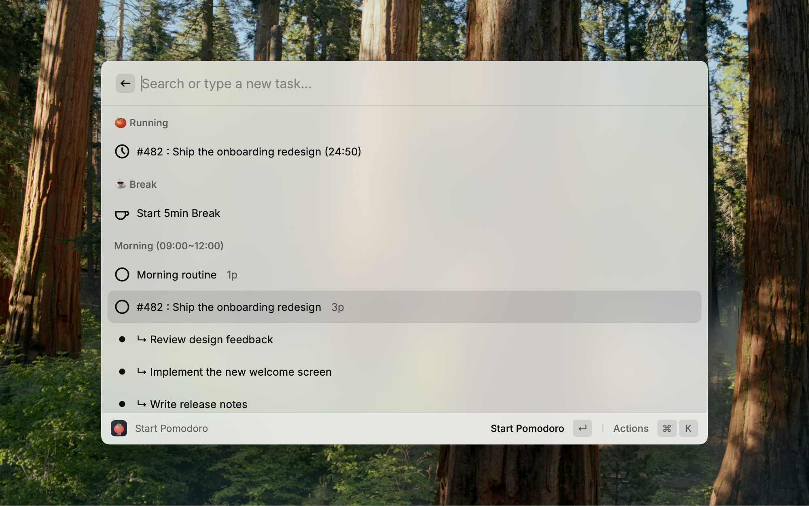
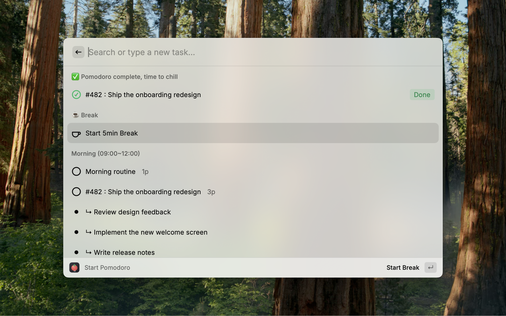
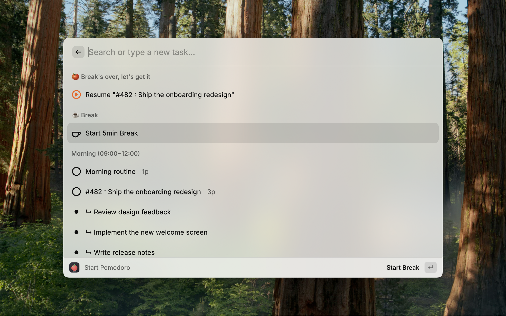
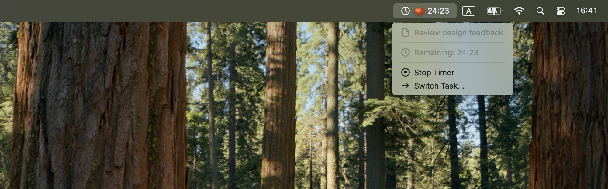
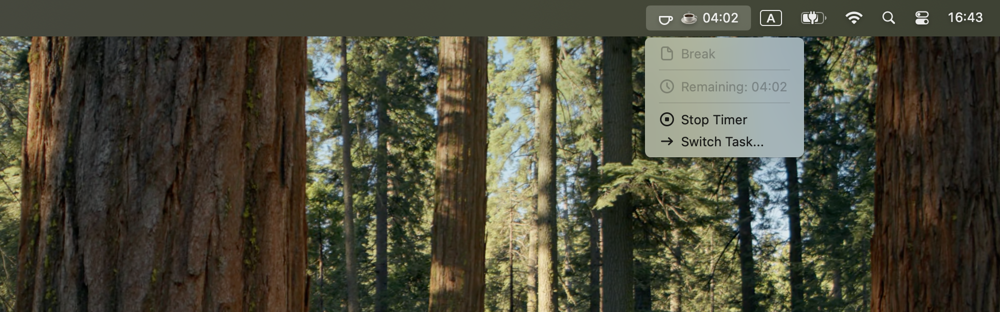
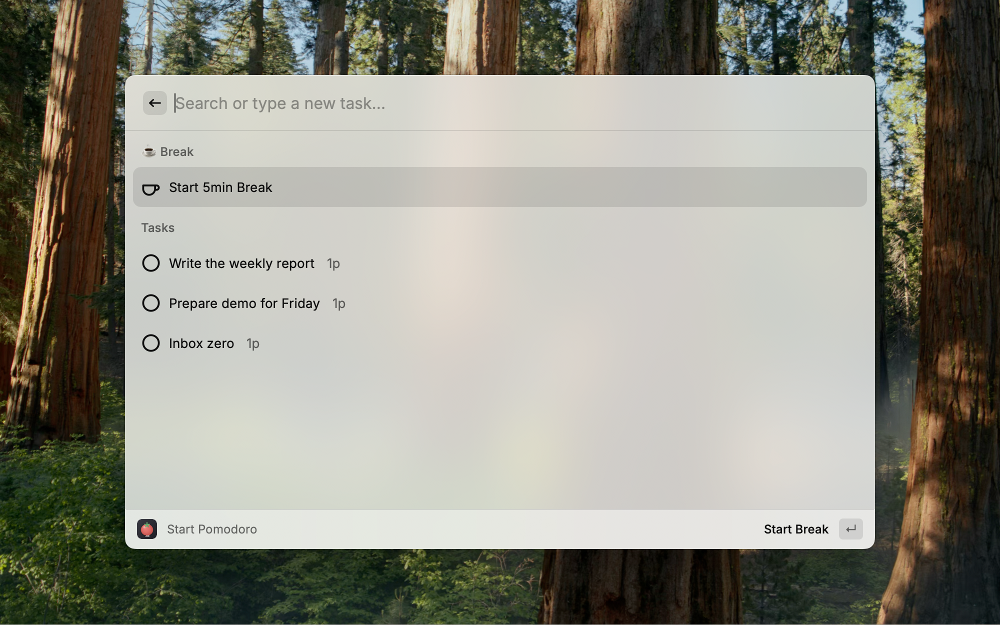

<div align="center">
  
  <h1>Pomodoro.md</h1>
  <p>Markdown-native pomodoro timer for the LLM era</p>
</div>

Every pomodoro app keeps your plan and your history inside its own database. You cannot diff it, you cannot paste it into a prompt, and when you stop using the app it is gone.

Pomodoro.md uses plain markdown as its interface instead. Your daily plan is a markdown timetable — in Obsidian, or any plain text file:

```markdown
# Timetable

## Morning (09:00~12:00) 6p
- 1p Morning routine
- 3p #482 : Ship the onboarding redesign
	- Review design feedback
	- Implement the new welcome screen
	- Write release notes
- 2p Reply to code reviews
```

It becomes a task list in Raycast. Pick a task, run pomodoros:



…and the log is written back into the same note:

```markdown
### Pomodoro Log

- Morning routine
	- [x] 09:02-09:27
- #482 : Ship the onboarding redesign
	- [x] 09:32-09:57 Review design feedback
	- [ ] 10:01-10:14
```

Plain markdown in, plain markdown out — readable for you, and for an LLM agent that plans your day or reviews it:

```
LLM plans your day → markdown → Pomodoro.md → markdown log → LLM reviews your day
```

## Two Modes

Pick one in the extension preferences. Everything else works the same in both.

| | **Manual** (default) | **Daily Note** |
|---|---|---|
| Tasks come from | Typed into Raycast | A markdown timetable in your notes |
| Session log goes to | Nowhere — Manual mode keeps no log | Written into today's note as markdown |
| Setup needed | None | Point it at your notes folder |
| Good for | Using it as a plain pomodoro timer | Planning in Obsidian, or with an LLM |

## Commands

### Start Pomodoro

Lists today's tasks — grouped by time block in Daily Note mode — and starts a pomodoro (25 minutes by default) on the one you pick. Subtasks are listed under their parent and can be started on their own, so the log records which part you actually worked on.

Type anything into the search bar to start it as an ad-hoc task (in Manual mode it is added to your list). **Mark as Done** ticks the task off; in Daily Note mode it writes `[done]` straight into the note.

If a pomodoro is already running, picking another task asks for confirmation and **carries the remaining time over** rather than restarting the clock.



### Start Break

Stops the current pomodoro, writes its log entry, and starts a break — **remembering the task you were on**. When the break ends, the task list opens with a one-key **Resume** action for that task, so you don't have to find it again.





### Quick Start

Starts a pomodoro on a task name you configure once (e.g. `Morning Routine`) without opening any list. Anything already running is stopped and logged first.

### Stop Timer

Ends the current pomodoro or break. A stopped-early pomodoro is still logged, marked `[ ]` instead of `[x]`. A pomodoro that already ran its full length is recorded as completed, whichever command notices it first.

### Pomodoro.md Timer (menu bar)

Keeps the remaining time in the menu bar while you work, with the current task name and actions to stop or switch tasks. Breaks count down the same way. When the time is up, it opens the task list with a **Start Break** / **Resume** prompt.





## Manual Mode

The default, and the one to use if you just want a pomodoro timer. Tasks live inside Raycast: type a name into **Start Pomodoro** to add one and start it, then **Mark as Done** or **Remove Task** from the action panel (`⌘K`). No files are written, so there is no setup — switch to Daily Note mode whenever you want the log in your notes.



## Daily Note Setup

1. Set **Task Mode** to `Daily Note`
2. Set **Daily Note Directory** to your notes folder (e.g. `~/Obsidian/daily`)
3. If your notes are not named `YYYY-MM-DD.md`, adjust **Daily Note Filename** (e.g. `YYYYMM/YYYY-MM-DD.md` for monthly subfolders)

### Timetable format

Only two lines matter:

- `## Block name` — a time block, one heading level below the **Timetable Header** (`# Timetable` by default)
- `- 2p Task title` — a task, where `2p` is how many pomodoros you planned

Optional extras:

- `(09:00~12:00)` after the block name is shown next to it; a trailing `6p` (planned total) is accepted and ignored
- `	- Subtask title` — a subtask, indented with a tab or 2+ spaces
- `[done]` after `Np` (or after `- ` on a subtask) marks it as already finished
- Blocks named after a **Break Keyword** (`Break`, `Lunch`) are skipped
- Markdown links in titles are displayed as their link text

### Pomodoro log

Each finished session appends one line under its task's bullet in the **Pomodoro Log Header** section. The section is created on first use — inside the **Log Section Header** section if it exists, otherwise at the end of the note. `[x]` is a completed pomodoro, `[ ]` one you stopped early, and a trailing label is the subtask that was running. Nothing else in the note is rewritten, so notes you keep in that section stay put.

## Preferences

| Preference | Default | Description |
|------------|---------|-------------|
| Task Mode | `Manual` | `Manual` keeps tasks in Raycast; `Daily Note` reads them from markdown |
| Daily Note Directory | — | Folder containing your daily notes |
| Daily Note Filename | `YYYY-MM-DD.md` | Path of today's note relative to the directory; `YYYY`, `MM`, `DD` are replaced |
| Pomodoro / Break Duration | `25` / `5` | Length in whole minutes |
| Timetable Header | `# Timetable` | Header that starts the timetable section |
| Log Section Header | `## Work Log` | Section the pomodoro log is placed in |
| Pomodoro Log Header | `### Pomodoro Log` | Header of the pomodoro log itself |
| Break Keywords | `Break,Lunch` | Comma-separated block names to skip |
| Quick Start Task Name | `Morning Routine` | Task started by the Quick Start command |
| Enable Logging | `on` | Write the pomodoro log to the daily note |

## Limitations

- **Manual mode keeps no log.** Nothing is written anywhere; Raycast only remembers your last task so you can resume it. Markdown logging is what Daily Note mode is for.
- **Only today's note is written.** Pomodoro.md never edits an older note, and it does not create the note either — if today's file doesn't exist yet, the log is skipped. A session that runs past midnight is logged in the note for the day it *ended*.
- **The menu bar countdown updates every 10 seconds** in the background — Raycast's minimum interval — and every second while the menu is open.
- **End-of-timer prompts come from the menu bar command.** If you disable Pomodoro.md Timer, a finished pomodoro is still logged by whichever command you run next, but nothing opens when the time is up.
- **Task lines must start at the left margin** (`- 2p …`), and **subtasks must be indented** with a tab or at least two spaces; a single space is not recognised.
- **Tasks are matched by title** when marking them done, so two tasks that share the same first 20 characters can be ambiguous.

## Development

```bash
npm install
npm run dev    # develop with hot reload
npm run lint   # lint and format check
```

Commands in `src/` sit on top of small modules: `parser` (markdown → tasks), `timer` (stored timer state + session log), `session` (start/stop transitions — every command settles an expired timer before acting), `log-markdown` (appends one entry to a note), and swappable `task-source` / `log-writer` backends for Manual vs Daily Note mode.

## License

MIT
