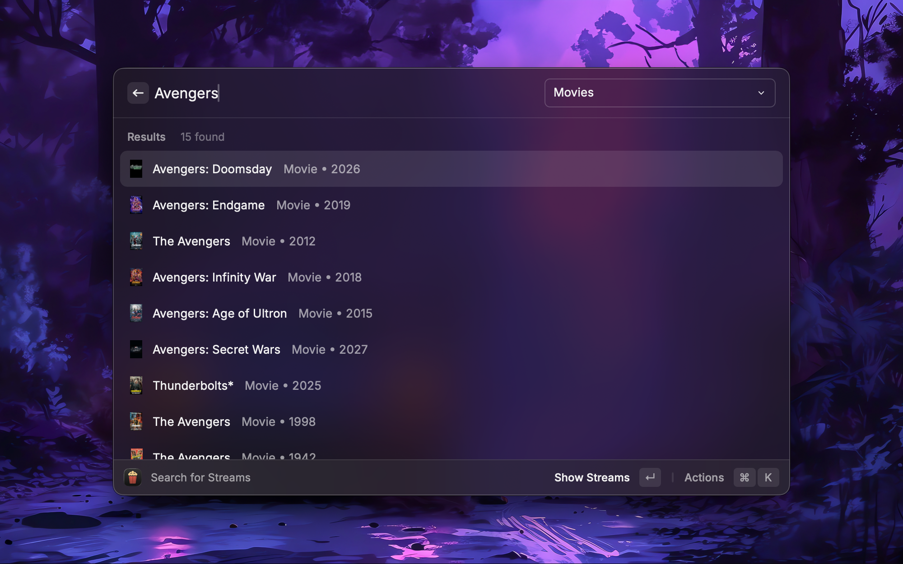
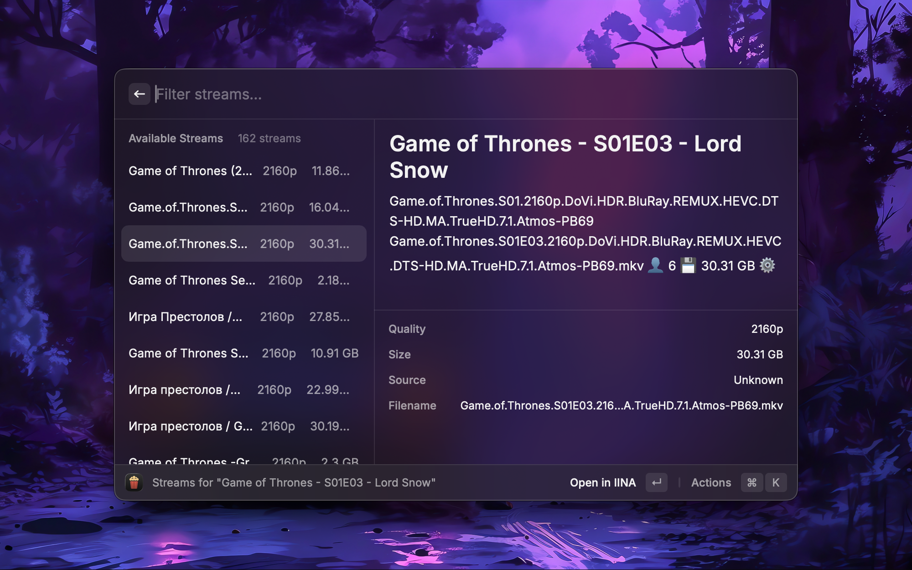

<h1> Popcorn</h1>

  
  
  

A Raycast extension that uses the Stremio API to search for movies and TV shows and stream them to local media players using Stremio addons. IINA is highly recommended for macOS users.

## Features

- 🎬 Search for movies and TV series
- 📈 Displays trending media
- ⚙️ Stremio addon support
- 🔗 Stream directly into IINA, VLC, or any app of choice
- ✅ Mark TV episodes as watched
- 👁️ Recently watched content
- 📋 Copy stream URLs to clipboard

## Usage

1. **Search Streams**: Type to search for movies or TV shows

## Full-functionality Requirements

- A Stremio addon that provides streams
- Media player (IINA or VLC recommended)

## Important Notice
This extension is designed to help you discover and organize media content. Please read and understand the following terms before using this extension.

## Content Discovery
- This extension helps you search for and discover publicly available media content
- Content streams are sourced from various public repositories and services
- We do not host, store, or distribute any copyrighted content
- All content is provided by third-party sources

## User Responsibility
- You are responsible for ensuring your use complies with local laws and regulations
- Respect intellectual property rights and copyright laws
- Only access content you have legal rights to view
- Use streaming services and platforms in accordance with their terms of service

## Privacy & Data
- Your search history and preferences are stored locally on your device
- No personal data is transmitted to external servers without your consent
- You can clear your data at any time through the extension settings

## Disclaimer
- We are not responsible for the availability, quality, or legality of content from third-party sources
- Use this extension at your own discretion and risk
- The extension developers are not affiliated with any streaming services or content providers

## Support
- For issues or questions, please refer to the extension documentation
- Report any concerns through the appropriate channels

## License

MIT
