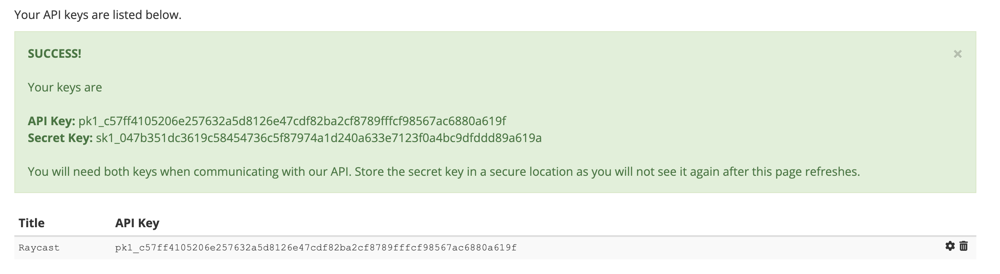
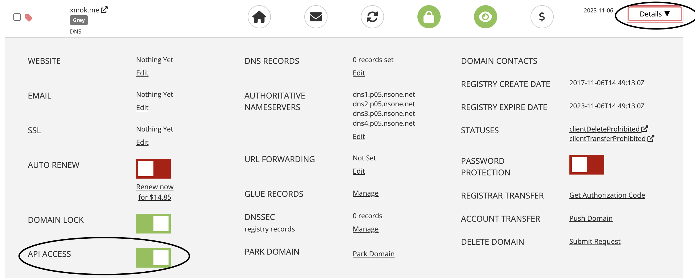

    

# Porkbun Raycast Extension

This is a Raycast extension for [Porkbun](https://porkbun.com/). With this extension, you can fetch latest domain pricing and create, list, edit or delete DNS records, URL Forwarding and Name Servers for API-enabled domains in your account.

## 🚀 Getting Started

1. **Install extension**: Click the `Install Extension` button in the top right of [this page](https://www.raycast.com/xmok/porkbun) OR via Raycast Store

2. **Get your API Key and API Secret Key**: The first time you use the extension, you'll need to enter your Porkbun API keys:

    a. `Sign in to your Porkbun Account` at [this link](https://porkbun.com/account/login)

    b. `Navigate` to [API page](https://porkbun.com/account/api)
    
    c. `Enter` 'API Key Title', click `Create API Key` and `copy` the 2 keys
    
  
    d. Enter `API Key` and `API Secret Key` in Preferences OR at first prompt

3. **Enable API access**: You will need to enable API access for each domain:

    a. `Navigate` to [Domain Management](https://porkbun.com/account/domainsSpeedy)

    b. `Toggle` the "Details tab" then toggle `API Access` for each domain
    

## 🔧 Commands

This extension provides the following commands:

- Create DNS Record
- Delete DNS Record
- Domain Pricing
- Edit DNS Record
- Ping
- Retrieve DNS Record
- Retrieve SSL Bundle
- Retrieve All Domains
    - Get Name Servers
        - Update Name Servers
    - Get URL Forwarding
        - Add URL Forwarding
        - Delete URL Forwarding