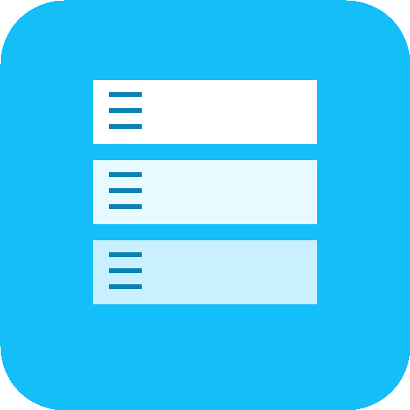

# Portainer for Raycast

Manage your Docker containers, stacks, images, volumes, and networks directly from Raycast via Portainer.



## Features

- **Containers**: List, start, stop, restart containers and view live logs (auto-refreshing)
- **Stacks**: Manage Docker Compose stacks
- **Images**: Browse Docker images with size and tag info
- **Volumes**: View volumes and mount points
- **Networks**: Explore Docker networks

## Installation

1. Clone this repository
2. Run `bun install`
3. Run `bun run dev` to start development mode
4. The extension will appear in Raycast

## Configuration

Configure the extension in Raycast Preferences:

| Preference                 | Description                                                              | Required |
| -------------------------- | ------------------------------------------------------------------------ | -------- |
| **Portainer URL**          | Your Portainer instance URL (e.g., `https://portainer.example.com:9443`) | Yes      |
| **API Key**                | Your Portainer API access token                                          | Yes      |
| **Default Environment ID** | Specific environment ID to use (auto-detected if empty)                  | No       |

### Getting an API Key

1. Log in to your Portainer instance
2. Go to **My Account** (click your username)
3. Scroll to **Access Tokens**
4. Click **Add access token**
5. Give it a name and copy the generated token

## Commands

| Command    | Description                       | Shortcut |
| ---------- | --------------------------------- | -------- |
| Containers | List and manage Docker containers | -        |
| Stacks     | List and manage Portainer stacks  | -        |
| Images     | List Docker images                | -        |
| Volumes    | List Docker volumes               | -        |
| Networks   | List Docker networks              | -        |

### Container Actions

- **Start/Stop/Restart** container
- **View Logs** with auto-refresh (every 3 seconds)
- **Copy** container ID or name
- **Open in Portainer** web UI

### Keyboard Shortcuts

| Shortcut          | Action                          |
| ----------------- | ------------------------------- |
| `Cmd + R`         | Refresh list/logs               |
| `Cmd + Shift + P` | Toggle auto-refresh (logs view) |
| `Cmd + C`         | Copy ID                         |
| `Cmd + Shift + C` | Copy name                       |
| `Cmd + O`         | Open in Portainer               |
| `Cmd + L`         | View container logs             |

## Development

```bash
# Install dependencies
bun install

# Start development mode
bun run dev

# Build for production
bun run build

# Lint code
bun run lint

# Fix lint issues
bun run fix-lint
```

## Tech Stack

- [Raycast API](https://developers.raycast.com/)
- [Portainer API](https://docs.portainer.io/api/access)
- TypeScript
- React

## License

MIT
