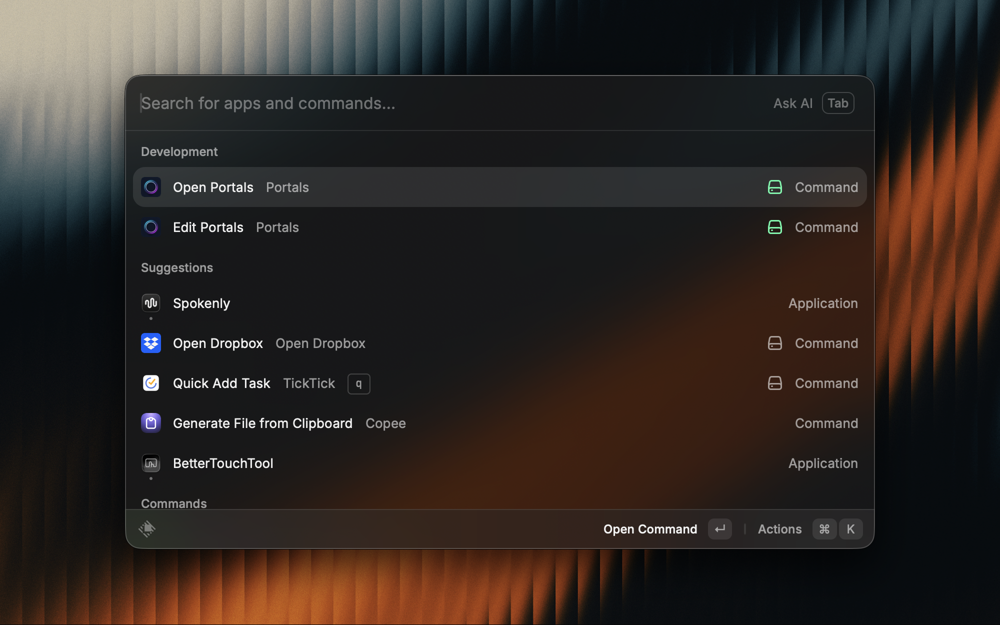
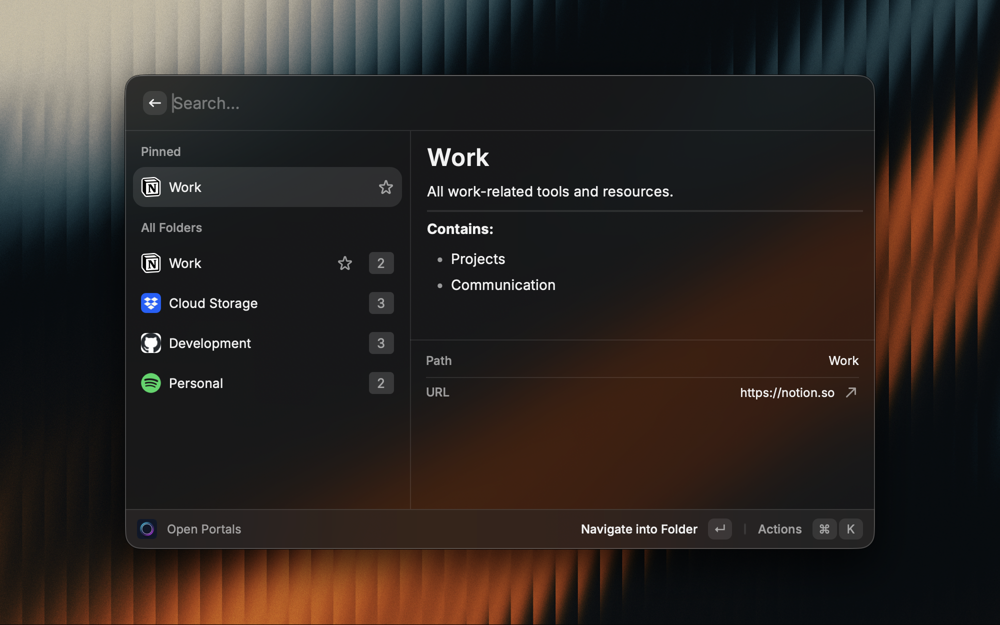
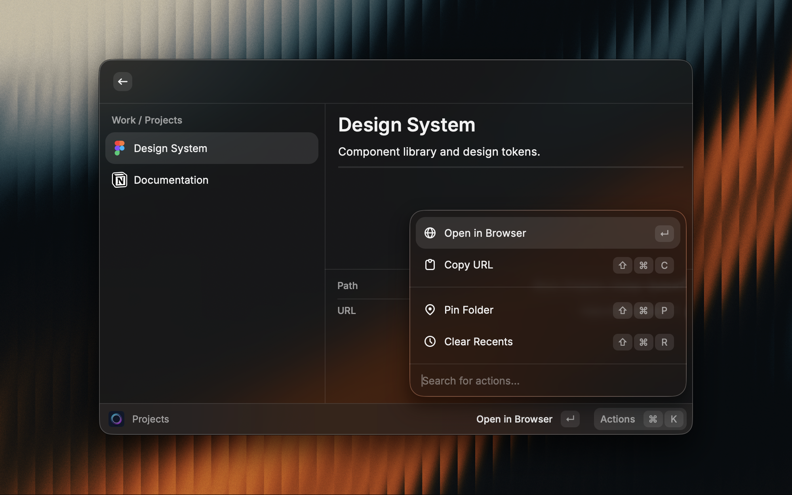

# Portals

Navigate any hierarchy of URLs instantly — no API, no account, no setup required.

Portals works with **any destination**: websites, Dropbox folders, Google Drive, Notion pages, deep links, local file paths, or any custom URL structure you define. You build the tree yourself, and Portals gives you a fast, keyboard-driven way to navigate and open them directly from Raycast.

## Screenshots

---

## Commands

### Open Portals
Your main navigation view. Browse your portal hierarchy with a full detail panel showing:
- Full path breadcrumb
- Portal description (if set)
- List of subfolders contained inside
- Direct URL link

**Keyboard shortcuts:**
| Action | Shortcut |
|---|---|
| Navigate into folder | `↵` |
| Open In Browser | `⌘ ↵` |
| Copy URL | `⌘ ⇧ C` |
| Pin / Unpin | `⌘ ⇧ P` |
| Clear Recents | `⌘ ⇧ R` |

**Sections:**
- **Pinned** — Portals you've pinned for quick access, always at the top
- **Recent** — Last 5 portals you opened, for fast re-access
- **All Folders** — Your complete portal tree

---

### Edit Portals
Add, edit, and organize your portal structure without leaving Raycast.

**Keyboard shortcuts:**
| Action | Shortcut |
|---|---|
| Add subfolder | `⌘ N` |
| Create folder at current level | `⌘ ⇧ N` |
| Edit folder | `⌘ E` |
| Export / Import | `⌘ ⇧ E` |
| Delete folder | `⌘ ⌫` |

**Per portal you can set:**
- **Name** — Display name shown in the list
- **URL** — Any valid URL, deep link, or local path
- **Description** — Optional notes shown in the Open Portals detail panel
- **Show description** — Toggle whether the description appears in the browse view
- **Move to** — Relocate the portal anywhere in the tree, with or without its subfolders

---

## Export & Import

Back up or share your entire portal tree as JSON. Open **Edit Portals**, select any portal, press `⌘ ⇧ E` to open the Export / Import screen, then `⌘ ⇧ C` to copy the JSON to your clipboard.

To import, paste previously exported JSON into the Import field and press Import. This replaces your current tree — export first as a backup.

---

## Works With Anything

Portals is not tied to any specific service. Any URL works:

- Dropbox shared folder links
- Google Drive folder URLs
- Notion pages and databases
- Confluence spaces
- SharePoint document libraries
- Raycast deep links (`raycast://`)
- Spotify, Linear, Slack, or any app with deep link support
- Local folders (`/Users/you/Projects`)
- Internal company tools
- Any bookmarked URL hierarchy

---

## No Account Required

Portals stores everything locally inside Raycast using its built-in storage. No sign-in, no API keys, no external services. Your portal tree lives entirely on your device and syncs nowhere.

---

## Platform Support

Works on **macOS** and **Windows**
