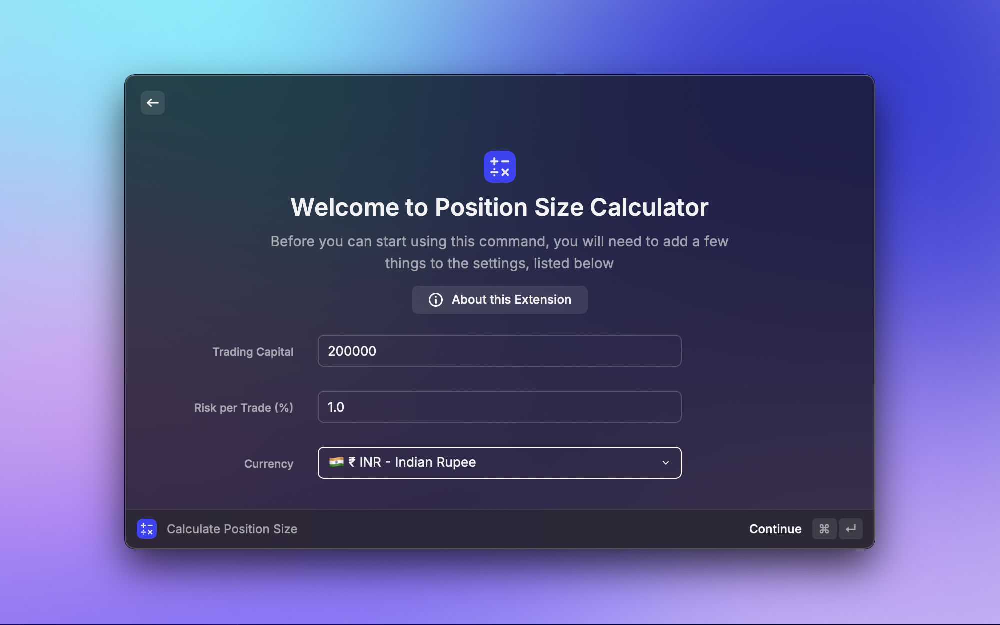

# Position Size Calculator - Raycast Extension

## Overview

The Position Size Calculator is a Raycast extension designed to help traders quickly and accurately determine the appropriate position size for their trades. It considers your trading capital, risk tolerance, and various methods for defining stop loss and target levels. This ensures you manage risk effectively according to your trading plan.

## Features

- **Multiple Calculation Modes:** Choose the method that best suits your trading style.
- **Preference-Based Defaults:** Set your default trading capital, risk percentage and currency in Raycast preferences for faster calculations.
- **Clear Results:** Get a detailed breakdown of your trade parameters, including quantity, risk amount, potential reward, and more.
- **Easy Input:** User-friendly form with inline guidance for each input field.
- **Copy to Clipboard:** Quickly copy individual results or all calculated details.

## Screenshots

## Installation

1.  Ensure you have Raycast installed on your macOS.
2.  Search for "Position Size Calculator" in the Raycast Store and click "Install".
3.  (For local development) Clone the repository, navigate to the project directory, run `npm install` (or `yarn install`), and then `npm run dev` (or `yarn dev`).

## How to Use

1.  Open Raycast (Default shortcut: `⌥ Space`).
2.  Type the command name for this extension (e.g., "Calculate Position Size" or the alias you set).
3.  The Position Size Calculator form will appear.

### Preferences

Before your first use, or anytime you want to change your defaults, you can set your preferences:

1.  Open Raycast Settings (Type "Extensions" in Raycast, select the "Extensions" tab).
2.  Find "Position Size Calculator" in the list.
3.  Configure the following:
    - **Trading Capital:** Your total trading capital (e.g., `200000`).
    - **Risk per Trade (%):** The percentage of your capital you are willing to risk on a single trade (e.g., `1.0` for 1%).
    - **Currency:** Select your preferred currency from the dropdown list (e.g., `🇺🇸 $ USD - US Dollar`, `🇮🇳 ₹ INR - Indian Rupee`). The extension will use this for displaying all monetary values.

These preferences will be used as the base for calculations unless overridden by specific modes (like "Fixed Risk").

### Input Fields

1.  **Calculation Mode:** Select the method for determining your trade parameters:

    - **Fixed Price:** Define your Stop Loss and Target using exact price levels.
    - **RRR-Based:** Define your Stop Loss price and a desired Reward/Risk Ratio (RRR). The Target price will be calculated.
    - **% SL/Target:** Define your Stop Loss and Target as percentages away from your Entry Price.
    - **Fixed Risk:** Define your Stop Loss price and the exact currency amount you wish to risk. The `Risk per Trade (%)` preference is overridden for risk calculation in this mode. You also input an RRR to calculate a target for display.

2.  **Entry Price:** The price at which you intend to enter the trade.

3.  **Mode-Specific Inputs:** Depending on the selected mode, you will need to provide additional inputs:
    - **Stop Loss Price:** The price at which your trade will be closed to limit losses.
    - **Target Price:** The price at which you aim to take profits.
    - **Reward/Risk Ratio (RRR):** The desired ratio of potential reward to potential risk (e.g., `2` means you aim to make twice your risked amount).
    - **Stop Loss %:** The stop loss distance from entry, expressed as a percentage (e.g., `2.0` for 2%).
    - **Target %:** The profit target distance from entry, expressed as a percentage (e.g., `4.0` for 4%).
    - **Fixed Risk Amount:** The specific amount of currency (e.g., INR) you are willing to risk on this trade.

### Performing the Calculation

- Fill in all required fields based on your chosen mode.
- Press `↵` (Enter) or click the "Calculate" action.

### Understanding the Results

Once calculated, you'll see a detailed list of results:

- **Mode:** The calculation mode used.
- **Capital:** Your total trading capital (from preferences).
- **Risk Amount:** The actual currency amount risked on this trade.
- **Entry Price:** Your specified entry price.
- **Stop Loss:** The calculated stop loss price and its percentage distance from entry.
- **Target:** The calculated target price and its percentage distance from entry.
- **Risk / Share:** The amount you risk per share/unit if the trade hits your stop loss.
- **Quantity (Position Size):** The number of shares/units you should trade.
- **Investment (Exposure):** The total value of your position (Quantity \* Entry Price) and this amount as a percentage of your capital.
- **Potential Reward:** The total profit in currency if the trade hits your target.
- **Reward/Risk Ratio:** The calculated RRR for the trade.

You can use the `ActionPanel` (usually `⌘ K`) on any result item to copy its value or all results.

## Calculation Logic by Mode

- **Fixed Price:**

  - `Stop Loss = Input SL Price`
  - `Target = Input Target Price`
  - `Risk per Share = Entry Price - Stop Loss Price`
  - `Risk Amount = Capital * (Risk per Trade % / 100)`
  - `Position Size = Risk Amount / Risk per Share`

- **RRR-Based:**

  - `Stop Loss = Input SL Price`
  - `Risk per Share = Entry Price - Stop Loss Price`
  - `Target = Entry Price + (Risk per Share * Input RRR)`
  - `Risk Amount = Capital * (Risk per Trade % / 100)`
  - `Position Size = Risk Amount / Risk per Share`

- **% SL/Target:**

  - `Stop Loss = Entry Price * (1 - (Input SL % / 100))`
  - `Target = Entry Price * (1 + (Input Target % / 100))`
  - `Risk per Share = Entry Price - Stop Loss`
  - `Risk Amount = Capital * (Risk per Trade % / 100)`
  - `Position Size = Risk Amount / Risk per Share`

- **Fixed Risk:**
  - `Stop Loss = Input SL Price`
  - `Risk per Share = Entry Price - Stop Loss Price`
  - `Risk Amount = Input Fixed Risk Amount` (Overrides % risk from preferences)
  - `Position Size = Risk Amount / Risk per Share`
  - `Target = Entry Price + (Risk per Share * Input RRR)` (RRR is used here to calculate a target for informational purposes)

## Contributing

Feel free to open an issue for bugs, feature requests, or submit a pull request.

## License

This project is licensed under the MIT License.
