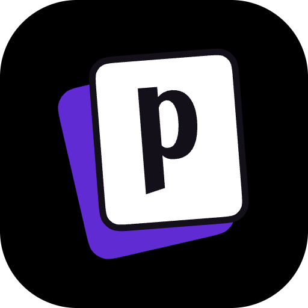

    

# Postiz

This is a Raycast extension for [Postiz](https://postiz.com/) - _The All-in-One Social Media Management Tool_. With this extension you can:

- Search Channels
- Search Posts (**week**)
    - Create (**draft**, **text-only**) Post
    - Delete Post

## 🚀 Getting Started

1. **Install extension**: Click the `Install Extension` button in the top right of [this page](https://www.raycast.com/xmok/postiz) OR `install` via Raycast Store

2. **Enter your Postiz URL**:

    - If you are using hosted Postiz, leave the field unchanged as "https://api.postiz.com/" 
    - If you are self-hosting, `enter` the base url ONLY e.g. "https://postiz.example.com/"

3. **Get your Postiz Public API Key**:

    - `Navigate` to **Settings**
    - `Click` "Reveal"
    - `Click` "Copy Key"
    - `Paste` in **Preferences**

## ➕ More

Looking for more cool OSS? Try the following extensions:

