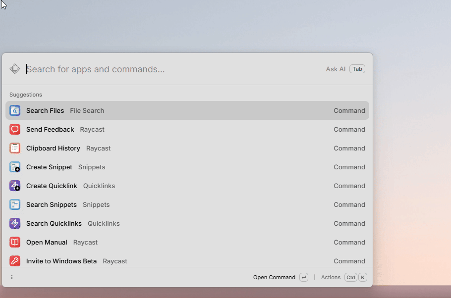

# Extension for listing and executing powershell functions

It lists the functions (without parameters) in a given ps1 file (parameter) and let you execute them.

how to install it:
- install Node JS (winget install -e --id OpenJS.NodeJS)
- clone the repository
- run: “npm ci” then “npm run dev”, which adds it to Raycast
