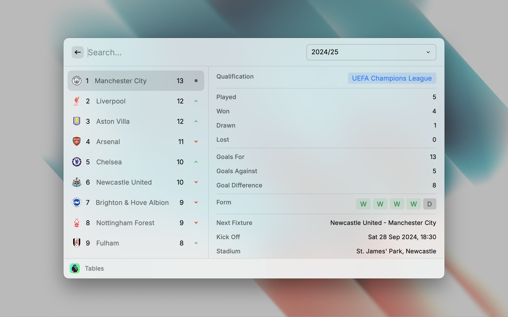

  <h1 align="center">Premier League</h1>

Get instant access to Premier League data right from your Raycast menu. Easily search for teams, players, fixtures, results, standings and awards.

**Premier League** is an extension designed to provide comprehensive information and statistics about the English Premier League in [Raycast](https://raycast.com/). It offers a user-friendly interface to explore data on teams, players, matches, and standings.

### Features

* **Standings:** Access detailed standings information, including played matches, goals for/against, goal difference, points, and form.
* **Fixtures and Results:** Access upcoming and past match fixtures, results, and match details.
* **Clubs:** Explore individual team profiles with information on players, managers, and recent performance.
* **Players:** Search for player profiles, including statistics, career highlights, and transfer history.
* **Managers:** View manager profiles with information on teams managed and career achievements.
* **Awards:** Explore a list of Premier League individual and team awards, including winners and statistics.

## Issues

Report bugs or suggest improvements by creating an issue [here](https://github.com/anhthang/raycast-premier-league/issues).
