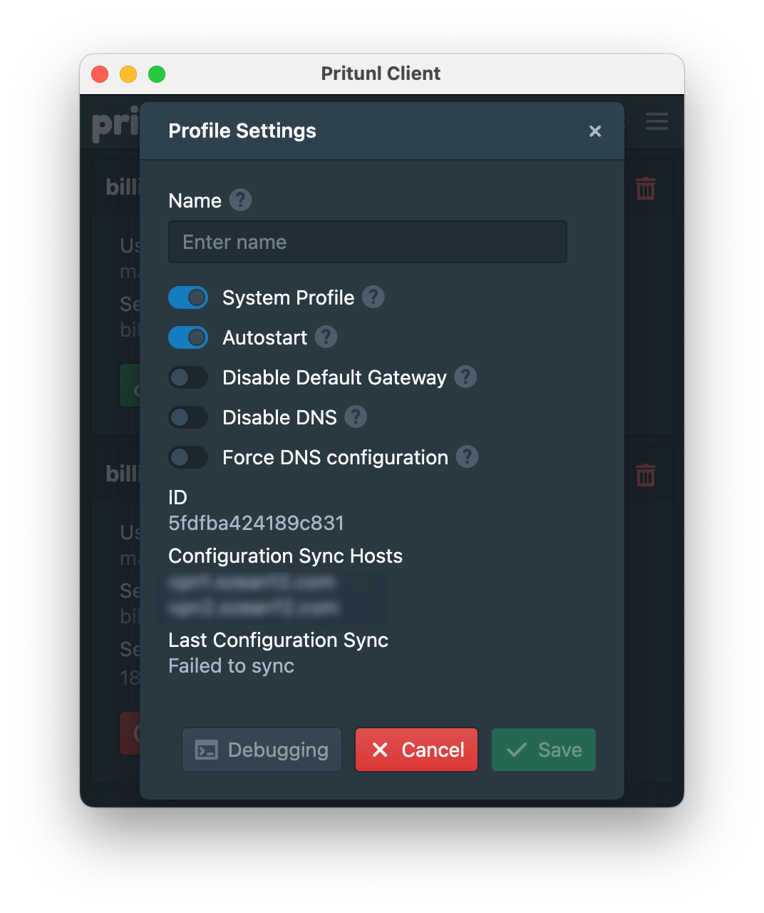
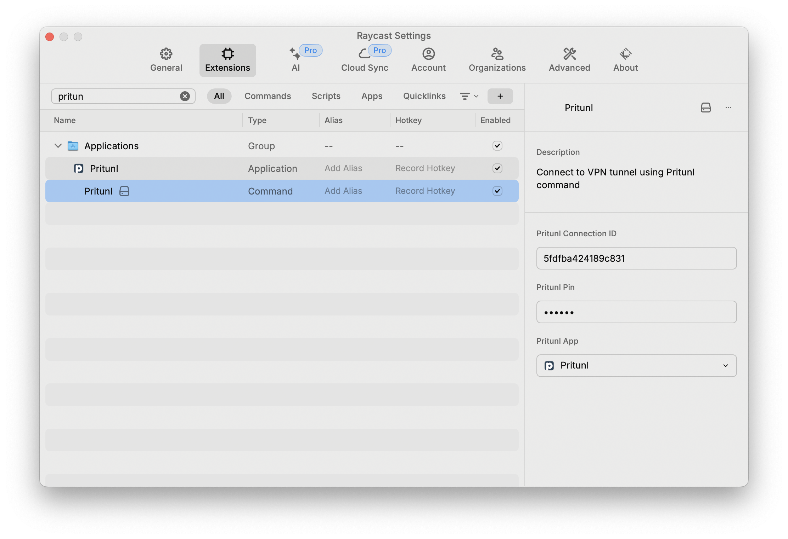

# Pritunl

Extention helps to quickly connect to already configured Pritunl VPN tunnel.

For the sake of simplicity, there is no UI support for multiple connections.

## Setup

1. Open extention settings and select "Pritunl App" from dropdown menu.
2. Find your connection id using command 

``` shell
/Applications/Pritunl.app/Contents/Resources/pritunl-client list -j | jq
```

or just copy from the Pritunl connection settings from UI as per screenshot.



and put it to the extention Pritunl Connection ID field.

3. Set your PIN for the connection.



## Usage 

Run pritunl command in Raycast and enjoy automated VPN connection.

The small notification "Pritunl is connecting" should appear.
