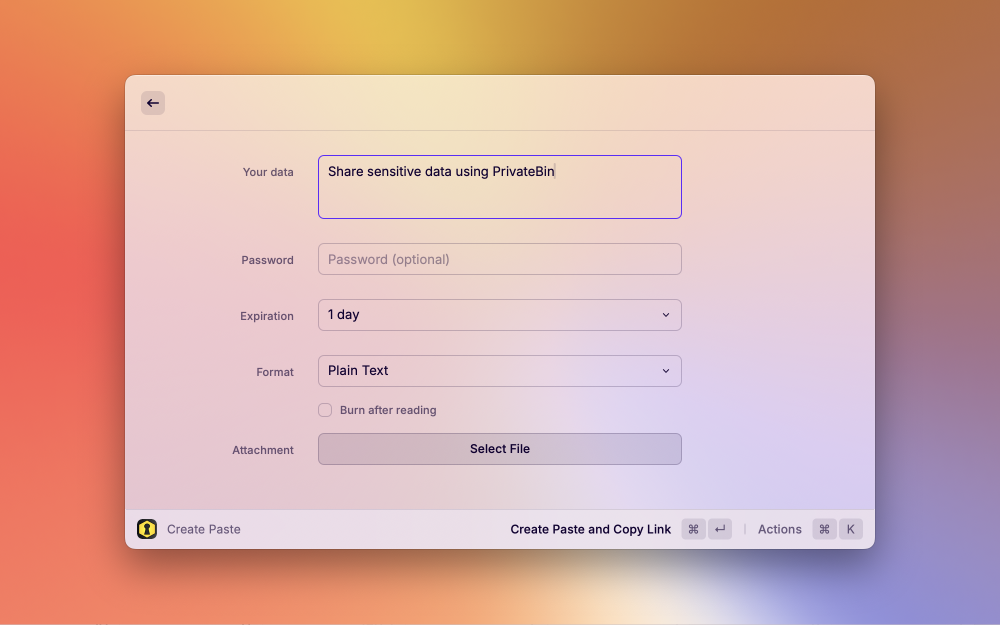

  
  <h1 align="center">PrivateBin</h1>

Share your sensitive information using a zero-knowledge opensource pastebin - [PrivateBin](https://privatebin.info/).

This extension provides you the ability to configure a URL of your PrivateBin,
so you can host your PrivateBin yourself or use one of many open-running [instances](https://privatebin.info/directory/). 

It offers almost the full feature set of the web version including setting passwords,
expiration or including attachments.

