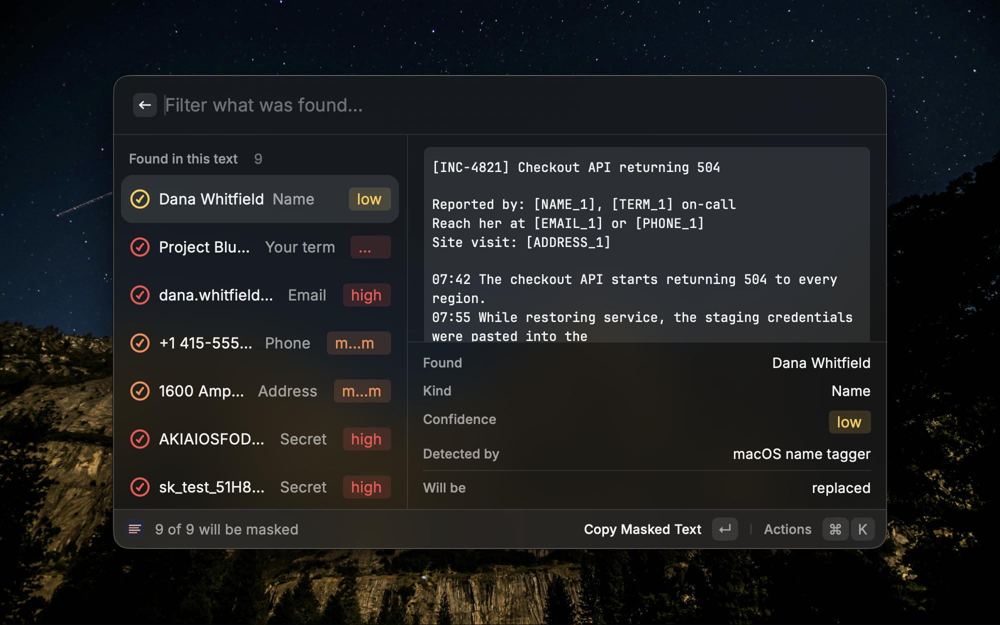

# Privacy Mask

Find personal information in text and mask it before you share it.

Made for the moment just before you paste an incident report, a log, or a
customer record into Slack or a GitHub issue — when you realise there is a name
in it.



## Why this one

Everything runs on your Mac. Nothing is sent anywhere, and no rules are fetched
from anywhere either.

It handles Japanese properly, which is the part other tools miss. Japanese
personal names, addresses and My Numbers cannot be found by pattern matching,
so this extension uses macOS's own detectors and Apple Intelligence's on-device
model instead:

| What | Found by |
|---|---|
| Phone numbers, addresses | `NSDataDetector` — Apple's models, including full-width and unhyphenated Japanese formats |
| My Number | Pattern plus check-digit validation, so an order number is not mistaken for one |
| Email, postal codes | Patterns |
| Credentials — API keys, tokens, secrets | A published prefix, or the name that introduces the value |
| Your own terms | A term list you keep |
| Japanese personal names | Apple Intelligence, on device |
| English personal names | `NLTagger` |

## How it works

Run **Mask Text** with something selected, or with text on the clipboard.

Everything found appears immediately, and the personal names follow a moment
later. The model reads the whole text a chunk at a time, so a long passage
takes longer than a short one, and there is no reason to make you wait for the
rest. If a chunk cannot be read, the extension says how much of the text went
unexamined rather than letting it pass as clean. Each finding shows how
confident the detection is, in red, orange or yellow, and which detector found
it. Everything is selected by default; press `⌘T` to leave one alone.

`↵` copies the masked text. `⌘⇧↵` pastes it straight into the app you came
from.

Values are replaced with numbered placeholders — `[NAME_1]`, `[EMAIL_2]` — and
the same value always gets the same number, so a reader can still follow who is
who. **This is not reversible.** No mapping is kept anywhere: that table would
be a second copy of exactly what the masking removed.

## Your own terms

Customer names, company names, project code names — the things no general
detector can know are sensitive. One per line:

```
# ~/.config/privmask/terms.txt
株式会社サンプル商事
Project Bluebird
```

Matching ignores case and character width. Spelling variants are matched by the
on-device model, so when that is unavailable the extension says so rather than
letting you assume the list was fully applied.

## Requirements

macOS 13 or later. **Japanese personal names additionally need macOS 26 with
Apple Intelligence enabled** — they are found only by the on-device model, and
nothing else can find them.

The model runs **by default** wherever it is available. Where it is not, the
extension tells you plainly that names were not looked for, rather than
returning a clean-looking result: a gap you cannot see is worse than one you
can. You can turn it off with the *Use the on-device language model* preference,
which makes the extension fully deterministic and much faster, at the cost of
Japanese names and of matching spelling variants of your own terms.

| | 13 – 25 | 26, Apple Intelligence off | 26, Apple Intelligence on |
|---|:--:|:--:|:--:|
| Phone numbers, addresses | ✅ | ✅ | ✅ |
| Email, postal codes, credentials, My Number | ✅ | ✅ | ✅ |
| Your term list, matched exactly | ✅ | ✅ | ✅ |
| English personal names | ✅ | ✅ | ✅ |
| **Japanese personal names** | ❌ | ❌ | ✅ |
| Spelling variants of your terms | ❌ | ❌ | ✅ |

## Under the hood

Detection lives in [privmask](https://github.com/snaka/privmask), a Swift
package and CLI you can use on its own:

```sh
cat app.log | privmask
```

## Developing

```sh
npm install
npx ray develop
```

The Swift side is fetched from the privmask repository, so nothing else needs to
be checked out. Raycast runs a development extension from wherever its source
lives, so keep the checkout in place while you use it.
