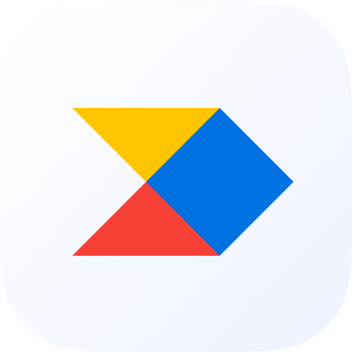
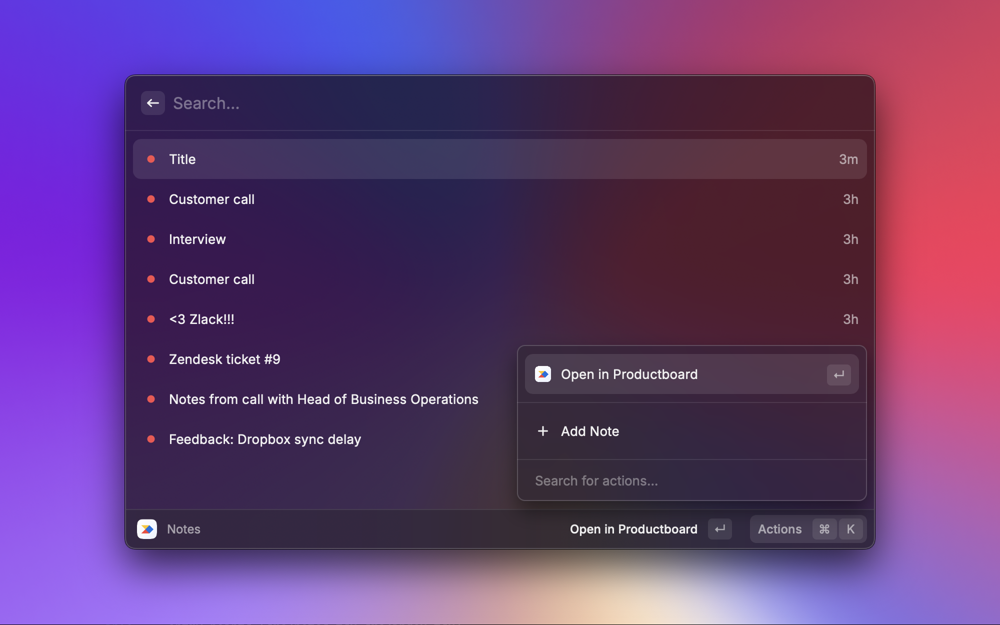

    

# Productboard

## ⚡ Features

Currently, this extension can:

- view existing **notes**
    - add new **notes**
- view **objectives**

## 🔧 Setup

You'll need a Public API Access token. To create access token:

1. `Go` to Integrations
2. `Scroll` down to _Public API_ section
3. `Create` a new one to use with Raycast (❗ You will need to have admin rights to be able to do it).
4. `Paste` access token into the Raycast preferences for this extension.

> NOTE: You need to create _Access token_. Do not confuse it with _GDPR Public API_ key.

## ➕ Additional Preferences

Adding metadata to your note can make the note triaging in Productboard easier. You can set default presets for them:

- Default tags – adds a default set of tags in add note dialog. Can be overriden.
- Default Said by – adds a default email to _Said by_ field in add note dialog. Can be overriden.
