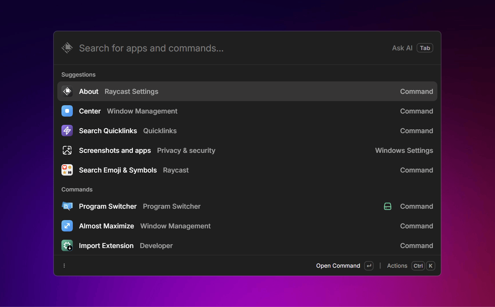

	
	<h1>Program Switcher - Raycast Extension</h1>
	

		<b>Seamlessly list, search and switch between open programs</b>
	

## Features

- **Program Switching** - Find and switch to any open program
- **Smart Search** - Search by program name or window title
- **Close Programs** - Gracefully close programs
- **Desktop Filtering (PowerShell mode only)** - Filter programs by current desktop or all desktops

## Usage

1. Open Raycast and search for "Program Switcher"
2. Browse or search through your open programs
3. Press `Enter` to switch to a program
4. Press `ctrl + k` for more actions

## Modes

Program Switcher supports two modes of operation:

- PowerShell (Native): Runs bundled PowerShell scripts that call Win32 APIs for comprehensive window enumeration and control. This mode supports desktop-level filtering. Press `ctrl + p` to toggle between showing programs from the current desktop or all desktops.
- Raycast Window Management (API): Uses Raycast's Window Management API instead of external scripts. This mode avoids spawning PowerShell but may provide different metadata depending on Raycast's API surface.

Switch between modes with `alt + t` while in the extension.

Note: Raycast's Window Management API is under active development and may not expose the same level of detail as the native PowerShell approach.

## Platform Support

- ✅ **Windows 10/11** - Fully supported with native implementation
- 🚧 **macOS** - Support planned for future release

## Credits

This extension is inspired by:

- [PowerToys Window Walker](https://github.com/microsoft/PowerToys/tree/main/src/modules/windowwalker)
- [Switcheroo](https://github.com/kvakulo/Switcheroo)
