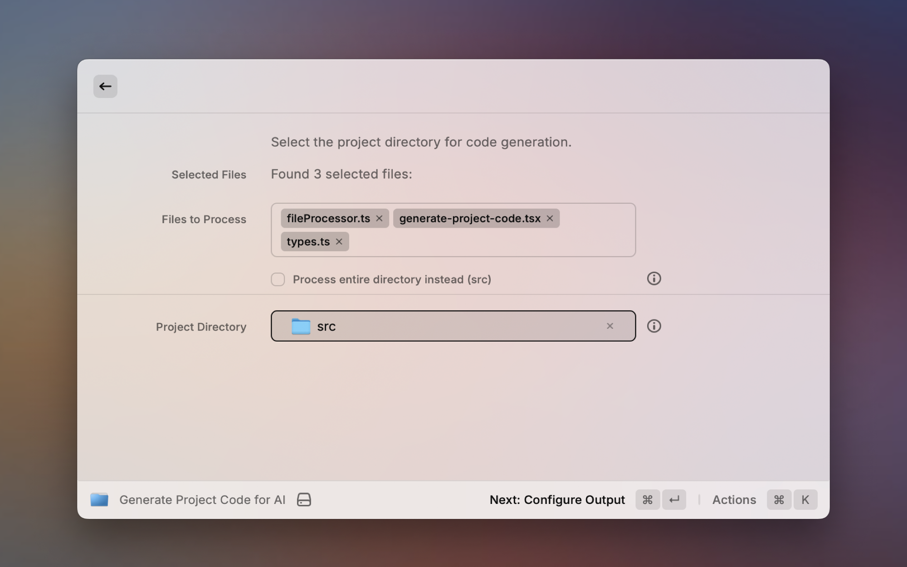

# Project Code to Text for Raycast

 

Ever needed to quickly grab all the code from a project, neatly packaged into one text file? This Raycast extension does just that! It's perfect for feeding your codebase to AI tools, creating an archive, or just having everything in one place for easy sharing and review.

## What It Does

This extension makes it super easy to consolidate your project. Here's a rundown of its cool features:

*   It smartly picks up the directory you've currently got selected in Finder, so when you launch the command, it's often ready with your project path.
*   No worries if nothing's selected, or if you want to choose a different folder; Raycast's familiar file picker is the first thing you'll see, pre-filled if a Finder selection was made.
*   The output is a well-structured text file. Inside, you'll find some basic project metadata (like when it was made and the root path), a clear tree showing your project's file structure, and then the actual content of each included file, neatly tagged with its path, size, and programming language.
*   You can choose whether to include special AI-specific instructions at the beginning and end of the file. These tags (`<ai_instruction>` and `<ai_analysis_guide>`) can help AI models better understand the context and purpose of the provided code. This option is enabled by default.
*   It's clever about what to include. Your `.gitignore` rules are respected, and common clutter like `node_modules`, `.git` folders, build outputs, and IDE-specific files are automatically skipped.
*   To keep things focused on your code, it also leaves out binary files, media, and really large files.
*   You get to customize the output a bit. It suggests a filename based on your project folder's name (like `my-project_project_code.txt`), but you can easily change it. You can also tell it the maximum size for individual files whose content should be included.
*   The final text file is conveniently saved right next to your project folder (in its parent directory), so it's easy to find.

## Getting Started

Using it is straightforward:

1.  First, fire up the command. You can open Raycast and type "Generate Project Code for AI" (or your chosen command title).
2.  Next, you'll confirm the project directory. If Finder had a folder selected, you'll see it pre-filled in the File Picker. Otherwise, just use the picker to choose your project's main folder. Then, hit "Next: Configure Output".
3.  Now, you'll set up your output file. The filename will be suggested based on your project folder, but feel free to edit it. You can also tweak the "Max File Size for Content (MB)" – files bigger than this will be mentioned, but their content won't be included. Here you'll also see a checkbox for "Include AI Instructions"; leave it checked if you want those helpful tags for AI tools, or uncheck it for a cleaner output. Once you're set, click "Generate File".
4.  That's it! You'll get a success notification. The generated text file will be waiting for you in the parent directory of your project folder. The notification will have handy actions to "Show in Finder" or "Copy Path to Clipboard".

## Why You Might Use This

*   This is great for feeding your entire project's context to Large Language Models (LLMs) like ChatGPT or Claude, especially with the AI instructions enabled. They can then help with code analysis, suggest refactoring, generate documentation, or answer questions about your codebase.
*   You can create a single-file snapshot of your project's text content at a specific moment, which is handy for archiving.
*   It can simplify code reviews by providing a consolidated view of the codebase.
*   It's also useful if you just want all your project's code in one searchable text file for offline reading.

## Contributing

Hey, contributions are awesome! If you've got ideas, find a bug, or want to add something cool:

1.  It's usually best to open an issue first so we can chat about your idea or the bug.
2.  If you're forking (for GitHub contributions), go ahead and do that.
3.  Make a new branch for your new feature or bug fix.
4.  Code away!
5.  Make sure the linter is happy (`npm run lint`).
6.  Then, send over a pull request.

## License

This is shared under the MIT License. 
---

**Crafted with ❤️ for the Raycast community!**