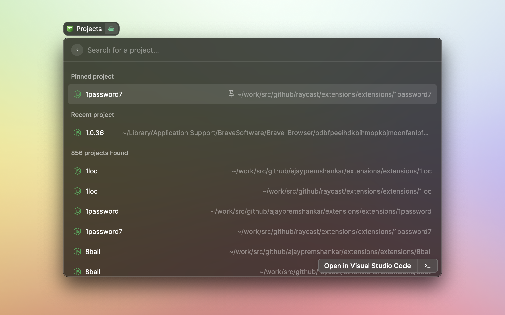
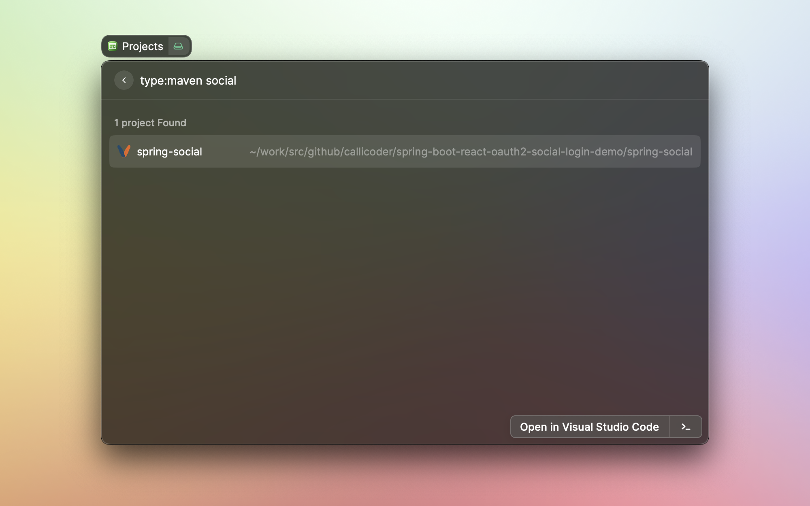
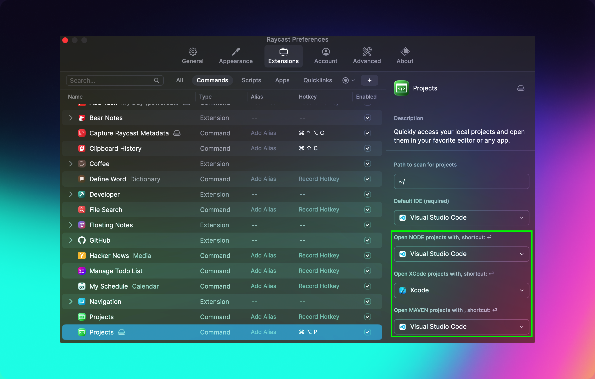
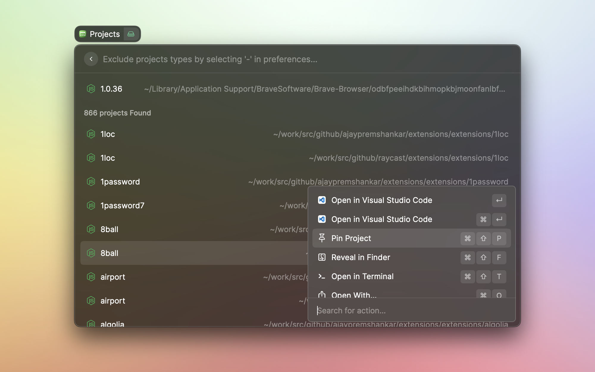
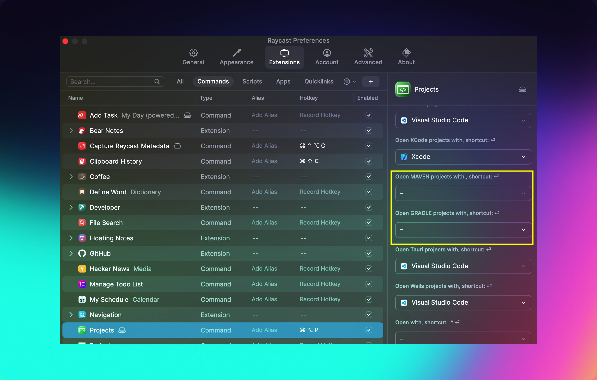

# Projects

Quickly access your local projects and open them in your favorite editor or any app

## Supports:

- Node (or any `package.json` based, including react/vue etc) projects (node)
- Maven projects (maven)
- Gradle projects (gradle)
- Xcode projects (xcode)
- Wails projects (wails)
- Tauri projects (tauri)

---

## Features:

### 1. Search by keywords

#### **Advanced Search**

- To search project types: use `type:<type>`. Supported types: `node`/`maven`/`gradle`/`xcode`/`tauri`/`wails`
- To search in a directory: use `dir:<part of directory>`.

### 2. Open projects in various IDEs

### 3. Pin frequently used projects at the top

### 4. Reveal project in Finder.

### 5. Open Terminal at project folder.

### 6. Include/exclude project from scanning.

To exclude particular project type, set '-' as choice of application in extension preferences.

---

## Roadmap

- [x] Search node projects.
- [x] Search maven projects.
- [x] Search any projects.
- [x] Search gradle projects.
- [x] Recently accessed projects.
- [x] Pinned projects.
- [x] Search Xcode projects.
- [x] Search tauri & wails projects.
- [x] Advanced search for projects.
- [x] Exclude project types from scanning.
- [ ] Refresh view after pinned/clicked.
- [ ] Hierarchy structure for mono repos/modules
- [ ] Delete projects

Connect with on slack @ajaypremshankar or [Ajay Prem Shankar on Linkedin](https://www.linkedin.com/in/ajaypremshankar/) for suggestions and contributions.
