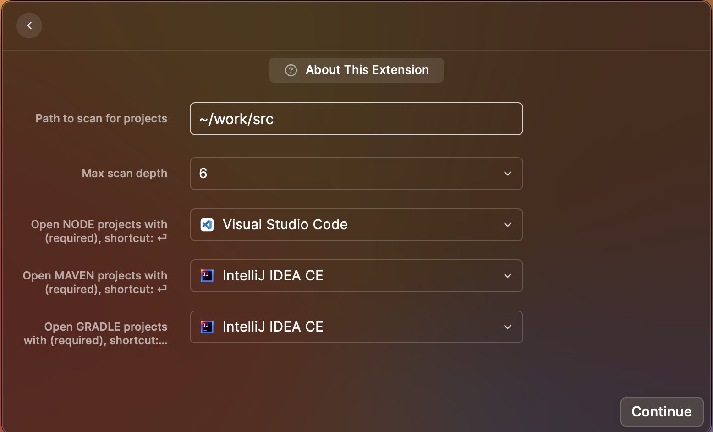
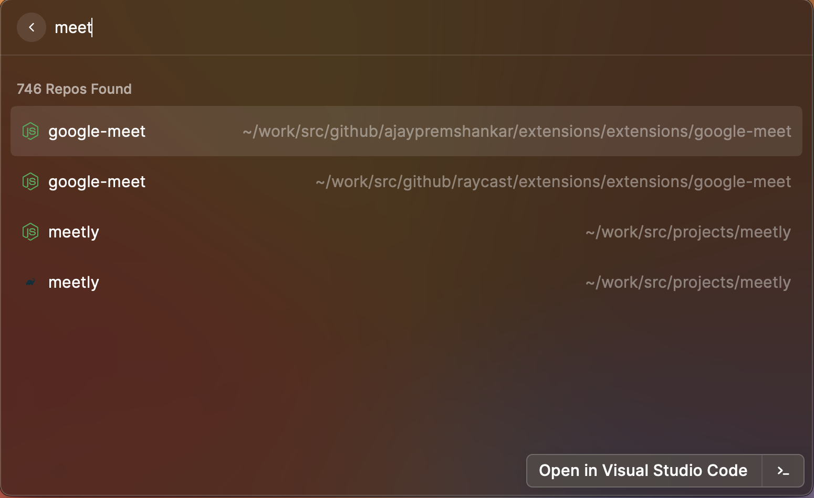

# Projects

Quickly access your local projects and open them in your favorite editor or any app

Features:

### 1. Open projects in various IDEs

### 2. Search Projects

### 3. Pin frequently used projects at the top

## Roadmap

- [x] Search node projects.
- [x] Search maven projects.
- [x] Search any projects.
- [x] Search gradle projects.
- [x] Recently accessed projects.
- [x] Pinned projects.
- [x] Refresh view after pinned/clicked.
- [ ] Hierarchy structure for mono repos/modules
- [ ] Delete projects
- [ ] Advanced search for projects.

Connect with on slack @ajaypremshankar or [Ajay Prem Shankar on Linkedin](https://www.linkedin.com/in/ajaypremshankar/) for suggestions and contributions.
