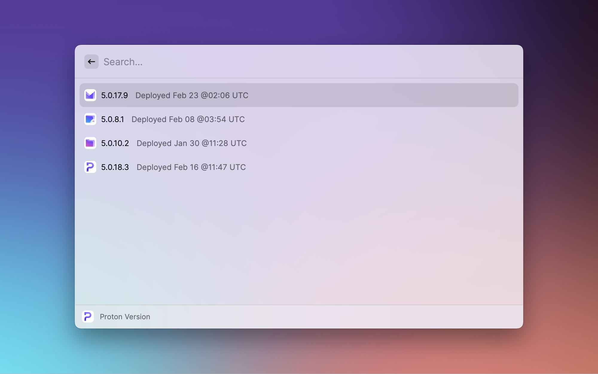

# Proton version

Get the latest default and beta version number of Proton products

Supported feature:

- Get the default (production) version of Proton products
- Get the beta version of Proton products
- Supports Proton Mail, Proton Drive, Proton Calendar and Proton Account
- Actions can redirect to Proton GitHub or to product homepage

