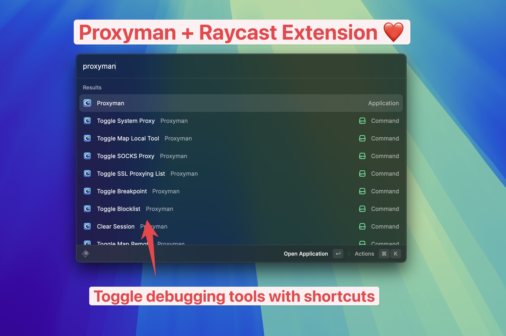

# Proxyman + Raycast Extension

- Toggle System Proxy
- Toggle Map Local Tool
- Toggle Breakpoint
- Toggle Blocklist
- Toggle Allowlist
- Toggle Map Remote
- Toggle Scripting
- Toggle External Proxy
- Toggle SOCKS Proxy
- Toggle Network Condition
- Toggle SSL Proxying List
- Toggle Record Traffic
- Clear Session

# ⚠️ Requirements
- Required Proxyman macOS 5.10.0 or later

# Installation and Setup
Before using the Proxyman Extension:

1. Make sure Raycast and Proxman is installed. [Download Proxyman](https://proxyman.io/)
2. Start Proxyman at least once to setup all the settings.
3. Install This Extension from Raycast Extension Marketplace.
4. Open Raycast Extension Preferences and enter your Proxyman license key.
5. Enjoy! ⭐️

# Proxyman Features
* 🖥️ **Native macOS Application:** Developed dusing Swift and Objective-C, leveraging Apple SwiftNIO for high-performance networking.
* 🍏 **Full Apple Silicon Support:** Optimize for M1, M2, and M3 chips.
* 🚀 **Designed for macOS Ventura & Sonoma:** Tailored for the latest macOS versions.
* 🌐 **Seamless Traffic Interception:** Effortlessly capture HTTP/HTTPS requests/responses and WebSocket data from web browsers, iOS, and Android devices.
* 🎨 **Modern User Interface:** Intuitive and sleek design for enhanced user experience.
* 🔎 **Advanced Filtering:** Multiple filter options for precise traffic analysis.
* 📱 **Cross-Platform Setup Guide:** Comprehensive instructions for iOS simulator, iOS devices, and Android devices.
* 🛠️ **Essential Debugging Tools:** 
  - Request Compose
  - Request Repeat
  - Wildcard/Regex Filtering
  - Multiple Filter Support
  - Customizable Columns
  - Convenient Toolbar
* 🔧 **Professional Toolkit:**
  - Breakpoint functionality
  - Local and remote mapping
  - Blacklisting
  - External Proxy
  - Caching
  - Protobuf
  - Custom Certificate Management
  - Scripting
  - Network Condition Simulation
  - Reverse Proxy
  - Diff Tool
  - Access Control
  - DNS Spoofing
* 💻 **Backend Development Integration:** Automatic traffic capture for NodeJS, Ruby, and Python applications.
* 🍎 **System Requirements:** Compatible with macOS 11 and later versions.

# Suggestion on new commands
- Please open a ticket at https://github.com/ProxymanApp/Proxyman/issues
- [Discord](https://discord.gg/tjWEq6Da42)

# Troubleshooting
If you encounter issues:

1. Ensure Proxyman app is running and properly configured.
2. Check for updates to both Proxyman and the Raycast Extension.
3. Restart Raycast or your computer if the extension is not responding.
4. If problems persist, create an issue on the Proxyman GitHub repository or reach out via the Proxyman Discord channel.

# Contact
For additional support or inquiries, please contact the Proxyman team at support@proxyman.io.

- 🌐 Website: [https://proxyman.io](https://proxyman.io)